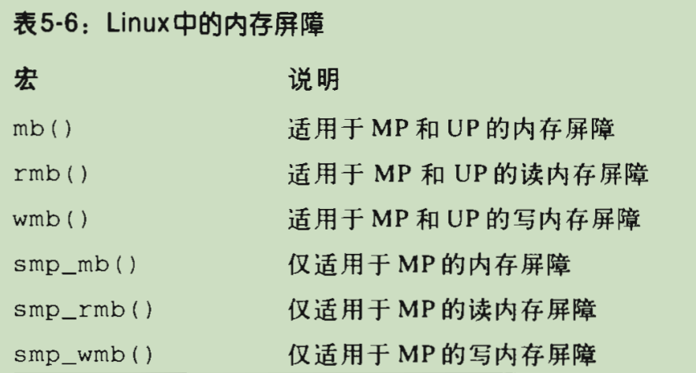
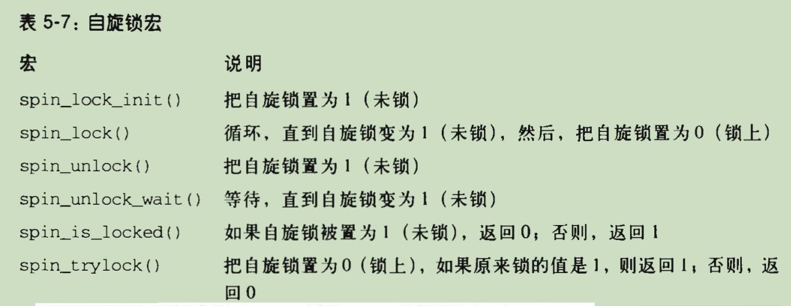

# 深入理解LINUX内核

# 第五章 内核同步

## 同步原语

### 每CPU变量

- 每CPU变量主要是数据结构的数组，系统的每个CPU对应数组的一个元素
- 对每CPU数组的并发访问不会导致高速缓存行的窃用和失效
- 对来自异步函数（中断处理程序和可延迟函数）的访问不提供保护，在这种情况下需要另外的同步原语
- 此外，在单处理器和多处理器系统中，内核抢占都可能使每CPU变量产生竞争条件。总的原则是内核控制路径应该在禁用抢占的情况下访问每CPU变量
- 

### 原子操作

- 避免由于“读-修改-写”指令引起的竞争条件的最容易的办法，就是确保这样的操作在芯片级是原子的。任何一个这样的操作都必须以单个指令执行，中间不能中断，且避免其他的CPU访问同一存储器单元
- 原子操作可以建立在其他更灵活机制的基础之上以创建临界区
- 当数据项的地址是以字节为单位的整数倍时，数据项在内存中被对齐。一般来说，非对齐的内存访问不是原子的

### 优化和内存屏障

#### 优化屏障（optimization barrier）

- 优化屏障原语保证编译程序不会混淆放在原语操作之前的汇编语言指令和放在原语操作之后的汇编语言指令，这些汇编语言指令在C中都有对应的语句

#### 内存屏障（memory barrier）

- 内存屏障原语确保，在原语之后的操作开始执行之前，原语之前的操作已经完成
- 因此，内存屏障类似于防火墙，让任何汇编指令都不能通过
- 内存屏障既用于多处理器系统，也用于单处理器系统。当内存屏障应该防止仅出现于多处理器系统上的竞争条件时，就使用smp_xxx()原语；在单处理器系统上，他们什么也不做。其他的内存屏障防止出现在单处理器和多处理器系统上的竞争条件
- 
- 注意，在多处理器系统上，在前一节“原子操作”中描述的所有原子操作都起内存屏障的作用，因为它们使用了lock字节

#### 自旋锁

- 自旋锁（spin lock）是用来在多处理器环境中工作的一种特殊的锁
- 一般来说，由自旋锁所保护的每个临界区都是禁止内核抢占的。在单处理器系统上，这种锁本身并不起锁的作用，自旋锁原语仅仅是禁止或启用内核抢占。请注意，在自旋锁忙等期间，内核抢占还是有效的，因此，等待自旋锁释放的进程有可能被更高优先级的进程替代 
- 
- 自旋锁和普通锁的区别
  - 自旋锁：当线程获取锁失败时，不会放弃 CPU，而是在一个循环中不断检查锁是否已释放（即 “自旋”/ 忙等）。它始终保持活跃，直到拿到锁为止
  - 普通锁：当线程获取锁失败时，会放弃 CPU，进入睡眠状态，直到锁被释放并且线程被唤醒。这个过程涉及“用户态->内核态”的切换和上下文切换，开销较大

##### 读写自旋锁

- 每个读/写自旋锁都是一个rwlock_t结构，其lock字段是一个32位的字段，分为两个不同的部分
  - 24位计数器，表示对受保护的数据结构并发地进行读操作的内核控制路径的数目。这个计数器的二进制补码存在在这个字段的0~23位中
  - “未锁”标志字段，当没有内核控制路径在读或写时设置该位，否则清0.这个标志存在于这个字段的第24位
  - 设置了“未锁”标志且无读者——0x01000000
  - “未锁”标志清0且无读者——0x00000000
  - 一个、两个或多个进程因为读获取自旋锁——0x00FFFFFF、0x00FFFFFE（“未锁”标志清0，读者个数的二进制补码在0~23位上）
  - 与spinlock_t结构一样，rwlock_t结构也包含break_lock字段
  - rwlock_init宏把读/写自旋锁的lock字段初始化为0x01000000，把break_lock字段初始化为0