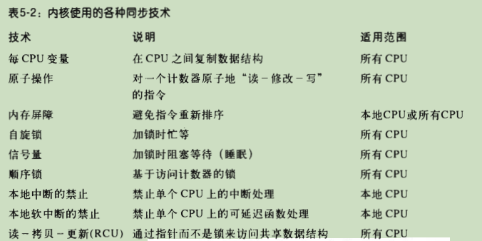
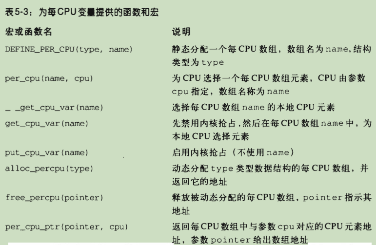

# 深入理解LINUX内核

# 第五章 内核同步

## 同步原语

### 每CPU变量

- 每CPU变量主要是数据结构的数组，系统的每个CPU对应数组的一个元素
- 对每CPU数组的并发访问不会导致高速缓存行的窃用和失效
- 对来自异步函数（中断处理程序和可延迟函数）的访问不提供保护，在这种情况下需要另外的同步原语
- 此外，在单处理器和多处理器系统中，内核抢占都可能使每CPU变量产生竞争条件。总的原则是内核控制路径应该在禁用抢占的情况下访问每CPU变量
- 

### 原子操作

- 避免由于“读-修改-写”指令引起的竞争条件的最容易的办法，就是确保这样的操作在芯片级是原子的。任何一个这样的操作都必须以单个指令执行，中间不能中断，且避免其他的CPU访问同一存储器单元
- 原子操作可以建立在其他更灵活机制的基础之上以创建临界区
- 当数据项的地址是以字节为单位的整数倍时，数据项在内存中被对齐。一般来说，非对齐的内存访问不是原子的

### 优化和内存屏障

#### 优化屏障（optimization barrier）

- 优化屏障原语保证编译程序不会混淆放在原语操作之前的汇编语言指令和放在原语操作之后的汇编语言指令，这些汇编语言指令在C中都有对应的语句

#### 内存屏障（memory barrier）

- 内存屏障原语确保，在原语之后的操作开始执行之前，原语之前的操作已经完成
- 因此，内存屏障类似于防火墙，让任何汇编指令都不能通过
- 内存屏障既用于多处理器系统，也用于