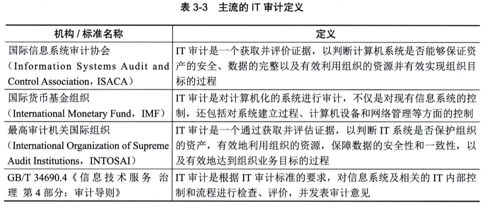
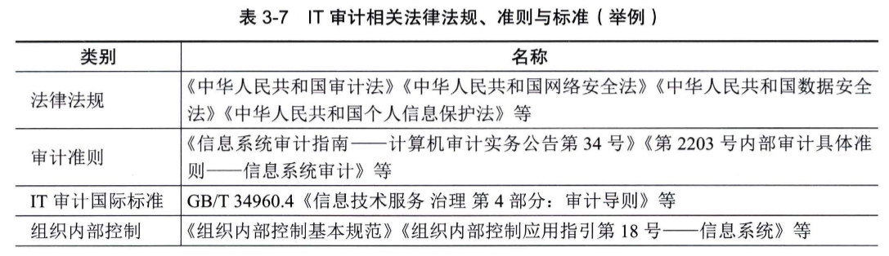
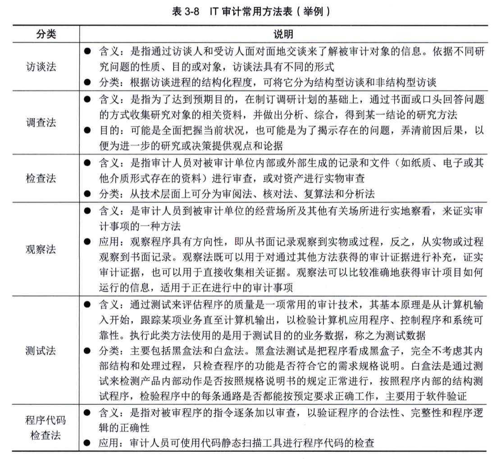
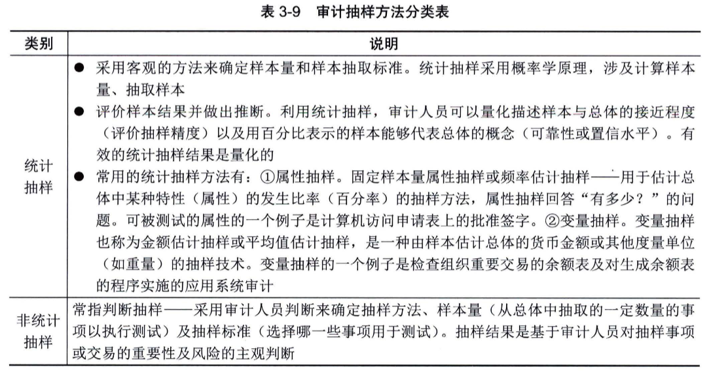
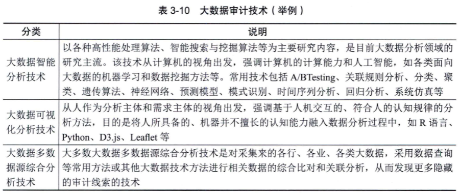
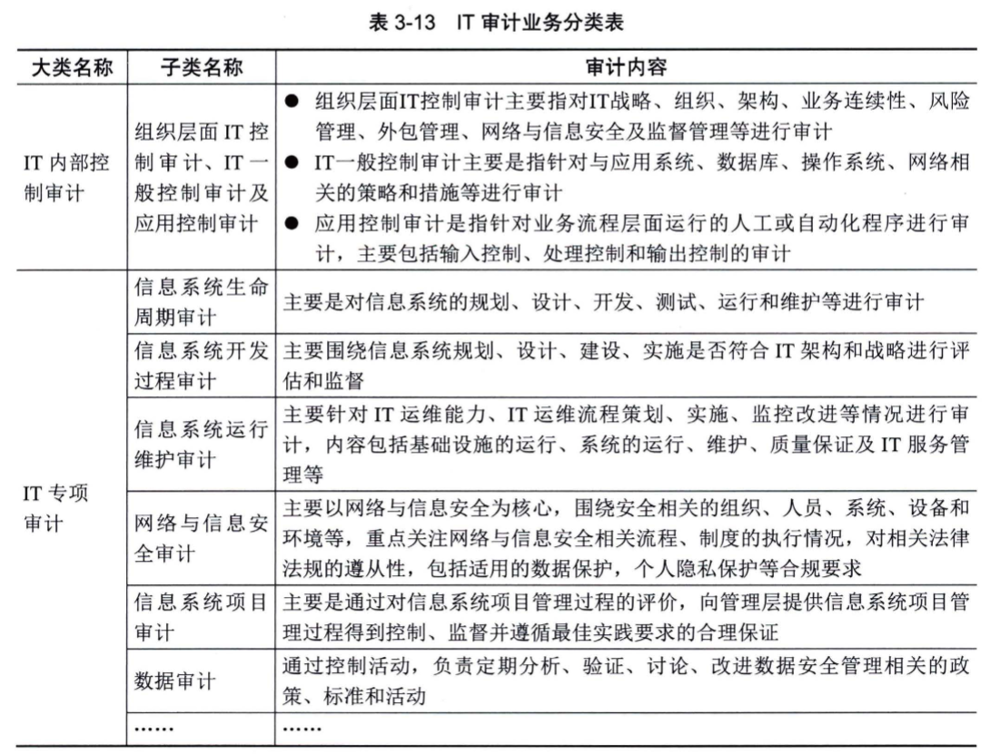
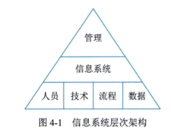
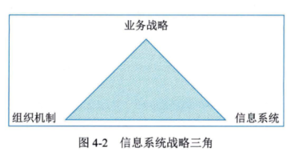

# 信息化发展知识体系

## 第1章 信息化发展

### 1.1 信息与信息化

- **信息**：
  - 定义（香农理论）：是用来消除随机不确定性的东西，单位比特（bit）（物质、能量及其属性的标示集合，是确定性的增加）
  - 数学公式：信息熵 \( H = -\sum_{i=1}^{n} P(x_i) \log_2 P(x_i) \)
  - 特征：客观性、普遍性、无限性、动态性等
  - 质量属性：精确性、完整性、可靠性、安全性等
- **信息系统**：
  - 定义：通过输入数据，然后进行加工处理，最后产生信息的系统
  - 组成：硬件、软件、数据库、网络、人员等
  - 生命周期：规划→分析→设计→实施→运行维护
- **信息化**：
  - 内涵：信息网络体系、信息产业基础、社会运行环境、效用积累
  - 体系：6要素（信息技术应用、信息资源、信息网络等）
  - 趋势：产品/产业/社会生活/国民经济信息化

### 1.2 现代化基础设施

- **新型基础设施建设**：
  - 分类：
    - 信息基础设施（5G、AI、数据中心）
    - 融合基础设施（智能交通、智慧能源）
    - 创新基础设施（重大科技设施）
  - 发展重点：5G部署、IPv6商用、全国一体化大数据中心
- **工业互联网**：
  - 体系：网络（互联互通）、平台（数据中枢）、数据（要素）、安全（保障）
  - 应用模式：平台化设计、智能化制造、网络化协同等
- **车联网**：
  - 体系框架：端（感知）、管（互联）、云（数据平台）
  - 场景应用：安全防护（碰撞通知）、便捷服务（语音控制）、效率提升（智能交通）

### 1.3 现代化创新发展

- **农业农村现代化**：
  - 农业信息化：物联网、大数据与农业融合
  - 乡村振兴：基础设施（5G/物联网）、智慧农业（数字田园）、数字乡村（政务服务）
- **两化融合与智能制造**：
  - 两化融合：技术/产品/业务/产业融合（如数控机床、工业软件）
  - 智能制造：自感知、自决策、自适应（GB/T 39116成熟度模型）

### 1.4 数字中国

- **数字经济**
  - 新技术经济范式：驱动力、新结构、价值创造和经济增长
  - 主要内容构成：数字产业化、产业数字化、数字化治理、数据价值化
- **数字政府**
  - 数字新特征：协同化、云端化、智能化、数据化、动态化
  - 主要内容：“一网通办”“跨省通办”“一网统管”
- **数字社会**
  - 数字民生：普惠、赋能、利民
  - 智慧城市：运用信息通信技术实现城市智慧化
  - 数字乡村：乡村现代化发展和转型进程
  - 数字生活：依托互联网和数字科技的生活方式
- **数字生态**
  - 数据要素市场：数据作为生产要素参与市场化配置
  - 数字营商环境：市场化、法治化、国际化、便利化
  - 网络安全保护：构建网络安全新格局

### 1.5 数字化转型与元宇宙

- **数字化转型**：
  - 基本原理：能力因子封装、决策边际化、持续迭代（CPSD模型）
  - 智慧转移：DIKW模型（数据→信息→知识→智慧）
- **元宇宙**：
  - 定义：虚实相融的数字空间（身份、经济、治理）
  - 特征：沉浸式体验、虚拟身份、虚拟经济、社会治理
  - 演进：数字人→数字组织→数字生态→数字社会治理

---

## 第2章 信息技术发展

### 2.1 基础技术

- **计算机软硬件**：
  - 硬件：超高速、超小型、智能化
  - 软件：功能集成化（如Docker容器技术）
- **计算机网络**：
  - 协议：OSI七层模型、TCP/IP四层模型
  - 技术：SDN（控制与数据分离）、5G（eMBB/uRLLC/mMTC）
- **存储与数据库**：
  - 存储技术：DAS/NAS/SAN、存储虚拟化、绿色存储
  - 数据库类型：
    - 关系型（ACID原则）
    - 非关系型（键值/列存储/文档/图数据库）
  - 数据仓库：ETL、OLAP、数据集市
- **信息安全**：
  - 基础属性：保密性、完整性、可用性
  - 技术：加密解密（对称/非对称）、UEBA（用户行为分析）、态势感知

### 2.2 新一代信息技术

- **物联网**：
  - 架构：感知层（传感器）、网络层（通信）、应用层（场景）
  - 关键技术：RFID、MEMS、分布式系统
  - 应用：智能家居、智慧城市、工业监控
- **云计算**：
  - 服务模式：IaaS（基础设施）、PaaS（平台）、SaaS（软件）
  - 关键技术：虚拟化（Docker）、云存储、多租户管理
  - 趋势：垂直行业应用、多云混合架构、生态建设
- **大数据**：
  - 特征：海量、多样、低价值密度、高速处理
  - 技术：
    - 数据获取（采集/清洗）
    - 分布式处理（Hadoop/Spark）
    - 数据管理（存储优化/隐私保护）
    - 应用服务（可视化/交互分析）
- **区块链**
  - 技术基础：多中心化、多方维护、时序数据等特征
  - 关键技术：分布式账本、加密算法、共识机制
  - 应用和发展：成为互联网基础协议之一，应用呈螺旋式上升趋势
- **人工智能**
  - 技术基础：机器学习、自然语言处理、专家系统等
  - 关键技术：机器学习、自然语言处理、专家系统
  - 应用和发展：向人机混合智能、自主智能系统发展，加速与其他学科交叉渗透
- **虚拟现实**
  - 技术基础：沉浸性、交互性、多感知性等特征
  - 关键技术：人机交互技术、传感器技术、动态环境建模技术、系统集成技术
  - 应用和发展：硬件性能优化迭代加快，网络技术助力应用化

---

## 第3章 信息系统治理

### 3.1 IT治理

#### 3.1.1 IT治理基础

- **定义（不重要）**
- **驱动因素（不重要）**
- **IT治理的目标价值**
- 与业务目标一致、有效利用信息与数据资源、风险管理
- 管理层次：最高管理层、执行管理层、业务与服务执行层

#### 3.1.2 IT治理体系

- 关键决策：IT原则、IT架构、IT基础设施、业务应用需求、IT投资和优先顺序
- 体系框架：IT战略目标、治理组织、治理机制、治理域、治理标准、绩效目标
- 核心内容：组织职责、战略匹配、资源管理、价值交付、风险管理、绩效管理
- 机制经验：建立简单、透明、适合的机制，借鉴最佳实践

#### 3.1.3 IT治理任务

全局统筹、价值导向、机制保障、创新发展、文化助推

#### 3.1.4 IT治理方法与标准

- ITSS中IT服务治理：通用要求、实施指南
- 信息和技术治理框架（COBIT）：治理和管理目标、治理系统组件、治理系统设计因素和流程
- IT治理国际标准（ISO/IEC 38500）：责任、战略、收购、性能、一致性、人的行为六项原则

### 3.2 IT审计

#### 3.2.1 IT审计基础

- **IT审计定义**
  - 简单理解为就是马后炮
  - 

- **IT审计目的**
  - **❗IT审计的目的**
    - 了解组织IT系统与IT活动的总体状况
    - 对组织是否实现IT目标进行审查和评价
    - 充分识别与评估相关IT风险
    - 提出评价意见及修改建议，促进组织实现IT目标
  - **❗组织的IT目标**
    - 组织的IT战略应与业务战略保持一致
    - 保护信息资产的安全及数据的完整、可靠、有效
    - 提高信息系统的安全性、可靠性及有效性
    - 合理保证信息系统及其运用符合有关法律、法规及标准等的要求
  - **IT目标 < 审计目标 < 组织目标**

- **IT审计范围**
  - **一般来说，IT审计范围需要根据审计目的和投入的审计成本来确定**
  - **IT审计范围的确定**
    - ❗总体范围：需要根据审计目的和投入的审计成本来确定
    - ❗组织范围：明确审计涉及的组织机构、主要流程、活动及人员等
    - ❗物理范围：具体的物理地点与边界
    - ❗逻辑范围：涉及的信息系统和逻辑边界
    - 其他相关内容

- **IT审计人员**
  - 对IT审计人员的要求包括：职业道德、知识、技能、资格与经验、专业胜任能力及利用外部专家服务等方面

- **❗IT审计风险**
  - **固有风险（天生调皮）**
    - **含义**
      - ❗是指IT活动不存在相关控制的情况下，易于导致重大错误的风险
    - **分类**
      - 可从IT组织层面控制、一般控制及应用控制三个方面分析固有风险
    - **特点**
      - ❗固有风险是IT活动本身所具有的，审计人员只能评估，却无法控制或影响它
      - 固有风险的衡量是主观的、复杂的，不同的IT活动其固有风险水平不同
  - **控制风险（家教不严）**
    - **含义**
      - ❗是指与IT活动相关的内部控制体系不能及时预防或检查出存在的重大错误的风险
    - **分类**
      - 可从IT组织层面控制、一般控制及应用控制三个方面分析控制风险**
    - **特点**
      - ❗与内部控制制度执行的有效性有关，与审计无关，属于内部控制的范畴，审计人员只能评估其风险水平而不能对其实施控制和影响
      - 其风险水平的衡量由于需要兼顾传统内部控制的思想和计算机系统管理的知识，因而较为复杂且难以准确计量
  - **检查风险（漏网之鱼）**
    - **含义**
      - 检查风险是指通过预定的审计程序未能发现重大、单个或其他错误相结合的风险
    - **影响检查风险的因素**
      - 由于IT审计规范不完善、审计人员自身或者技术原因等造成影响审计测试正确性的各种因素
  - **总体审计风险**
    - 是指针对单个控制目标所产生的各类审计风险综合

#### 3.2.2 审计方法与技术

- **IT审计依据与准则**
  - **国际常用审计准则**
    - ❗信息系统审计准则（ISACA）
    - ❗《内部控制一整体框架》报告（COSO）
    - ❗《萨班斯法案》（SOX）
    - ❗信息及相关技术控制目标（COBIT）
  - **我国IT审计法律法规准则和标准**
    - 

- **IT审计常用方法**
  - 
  
- **IT审计技术**

  - **❗风险评估技术**
    - **风险识别技术**
      - 用以识别可能影响一个或多个目标的不确定性，包括德尔菲法、头脑风暴法、检查表法、SWOT技术及图解技术等
    - **风险分析技术**
      - 是对风险影响和后果进行评价和估量，包括定性分析和定量分析
    - **风险评价技术**
      - 是在风险分析的基础上，通过相应的指标体系和评价标准，对风险程度进行划分，以揭示影响成败的关键风险，包括单因素风险评价和总体风险评价
    - **风险应对技术**
      - IT技术体系中为特定风险制定的应对技术方案，包括云计算、冗余链路、冗余资源、系统弹性伸缩、两地三中心灾备、业务熔断限流等
  
  - **❗审计抽样技术**
    - 审计抽样是指审计人员在实施审计程序时，从审计对象总体中选取一定数量的样本进行测试，并根据测试结果，推断审计对象总体特征的一种方法
    - 

  - **❗计算机辅助审计技术（CAAT）**
    - 也称为利用计算机审计，是指审计人员在审计过程和审计管理活动中，以计算机为工具来执行和完成某些审计程序和任务的一种新兴审计技术
    - 它并非电算化系统审计特有的一种方法，对手工系统的审计也可应用这些技术

  - **❗大数据审计技术**
    - **定义**
      - 大数据审计是指遵循大数据理念，运用大数据技术方法和工具，利用数量巨大、来源分散、
      格式多样的数据，开展跨层级、跨系统、跨部门和跨业务等的深入挖掘与分析，提升审计发现
      问题、评价判断、宏观分析的能力
    - **大数据审计技术**
      - 包括大数据智能分析技术、大数据可视化分析技术及大数据多数据源综合分析技术等
      - 

- **IT 审计证据**
  - **审计证据**
    - 定义：是指由审计机构和审计人员获取，用于确定所审计实体或数据是否遵循既定标准或目标，形成审计结论的证明材料
    - 重要性：审计证据是审计意见的支柱，是审计人员形成审计结论的基础
  - 特性：充分性、客观性、相关性、可靠性、合法性
  - 电子证据：定义、法律地位及处理流程
  - 证据评价因素：提供者独立性、客观性、时效性等

- **审计底稿**
  - **定义**
    - 审计工作底稿是指审计人员对指定的审计计划、实施的审计程序、获取的相关审计证据，以及得出的审计结论做出的记录
  - **作用**
    - 是形成审计结论、发表审计意见的直接依据
    - 是评价考核审计人员主要依据
    - 是审计质量控制与监督的基础
    - 对未来审计业务具有参考备查作用
  - **底稿分类**
    - ❗综合类工作底稿
      - 是指审计人员在审计计划阶段和审计报告阶段，为规划、控制和总结整个审计工作并发表审计意见所形成的审计工作底稿
      - 包括：审计业务约定书、审计计划、审计总结、审计报告、管理建议书、被审计单位管理当局声明书以及审计人员对整个审计工作进行组织管理的所有记录和资料
    - ❗业务类工作底稿
      - 指审计人员在审计实施阶段为执行具体审计程序所形成的审计工作底稿
      - 包括：符合性测试中形成的内部控制问题调查表和流程图、实质性测试中形成的项目明细表等
    - ❗备查类工作底稿
      - 指审计人员在审计过程中形成对审计工作仅具备备查作用的审计工作底稿

#### 3.2.3 审计流程

- **定义**
  - 审计流程是指审计人员在具体审计过程中采取的行动和步骤

- **审计流程作用**
  - 有效地指导审计工作
  - 有利于提高审计工作效率
  - 有利于保证审计项目质量
  - 有利于规范审计工作

- **❗审计四个阶段**
  - **审计准备阶段**
    - ❗定义
      - IT审计准备阶段是指IT审计项目从计划开始，到发出审计通知书为止的期间
    - 明确审计目的及任务
    - 组建审计项目组
    - 搜集相关信息
    - 指定审计计划等
  - **审计实施阶段**
    - ❗定义：IT审计实施阶段是审计人员将项目审计计划付诸实施的期间
    - 本阶段工作
      - 深入调查并调整审计计划
      - 了解并初步评估IT内部控制
      - 进行符合性测试
      - 进行实质性测试
  - **审计终结阶段**
    - ❗定义：IT审计终结阶段是整理审计工作底稿、总结审计工作、编写审计报告、做出审计结论的期间
    - 本阶段工作
      - 整理并复核审计工作底稿
      - 整理审计证据
      - 评价相关IT控制目标的实现
      - 判断并报告审计发现
      - 沟通审计结果
      - 出具审计报告
      - 归档整理等
  - **后续审计阶段**
    - 是在审计报告发出后的一定时间内，审计人员为检查被审计单位对审计问题和建议是否已经采取了适当的纠正措施，并取得预期效果的跟踪审计

#### 3.2.4 审计内容

- **IT审计业务和服务分为**
  - **IT内部控制审计**
    - 主要包括组织层面IT控制审计、IT一般控制审计、应用控制审计
  - **IT专项审计**
    - 主要是指根据当前面临的特殊风险或者需求开展的 IT 审计，审计范围为 IT 综合审计的某一个或几个部分
  - 

---

## 第4章 信息系统管理

### 4.1 管理方法

>上午选择题会考，2分起步

#### 4.1.1 管理基础

- **层次结构**
  - ❗信息系统四要素：人员、技术、流程、数据
  - 
  - 记忆口诀：“人流技数”

- **系统管理**
  - 四大领域
    - 规划和组织：针对信息系统的整体组织、战略和支持活动
    - 设计和实施：针对信息系统解决方案的定义、采购和实施，以及他们与业务流程的整合
    - 运维和服务：针对信息系统服务的运行交付和支持，包括安全
    - 优化和持续改进：针对信息系统的性能监控及其于内部性能目标、内部控制目标和外部
    要求的一致性管理

#### 4.1.2 规划和组织

##### 1.规划模型

- ❗信息系统战略三角
  - 

##### 2.组织模型

###### 业务战略

- **定义**：业务战略阐明了组织寻求的业务目标以及期望如何达成的路径
- **竞争力优势模型**
  - ❗总成本领先战略
    - 当组织的目标是成为市场上成本最低的生产者时，总成本领先战略就会产生
    - 采用该战略的组织通过最大限度地降低成本，从而获得高于平均水平的绩效

#### 4.1.3 设计和实施

- 设计方法：从战略到架构、从架构到设计、转换框架（内容、人员、位置）
- 架构模式：集中式、分布式、面向服务（SOA）

#### 4.1.4 运维和服务

- 运行管理和控制：过程开发、标准制定、资源分配、过程管理
- IT服务管理：服务台、事件管理、问题管理、变更管理、配置管理等
- 运行与监控：运行监控、安全监控
- 终端侧管理、程序库管理、介质控制、数据管理

#### 4.1.5 优化和持续改进

- PDCA循环：计划、执行、检查、处理
- DMAIC/DMADV五阶段：定义、度量、分析、改进/设计、控制/验证

### 4.2 管理要点

- 数据管理**
  - 能力域：数据战略、治理、架构、应用、安全、质量、标准、生命周期
  - 数据战略：规划、实施、评估
  - 数据治理：组织、制度建设、沟通
  - 数据架构：模型、分布、集成共享、元数据管理
  - 数据应用：分析、开放共享、服务
  - 数据安全：策略、管理、审计
  - 数据质量：需求、检查、分析、提升
  - 数据标准：业务术语、参考数据和主数据、数据元、指标数据
  - 数据生命周期：需求、设计开发、运维、退役
- **运维管理**
  - 能力模型：治理要求、运行维护服务能力体系、价值实现
  - 智能运维：能力要素（人员、技术、过程等）、能力平台、能力应用、智能特征
- **信息安全管理**
  - CIA三要素：保密性、完整性、可用性
  - 管理体系：安全策略、风险管理、审计、人员安全等
  - 网络安全等级保护：五级划分、安全保护能力要求

---

## 第5章 信息系统工程

### 5.1 软件工程

- **架构设计**
  - 软件架构风格：数据流、调用/返回、独立构件、虚拟机、仓库风格
  - 软件架构评估：敏感点、权衡点、基于场景的评估方法（ATAM、SAAM等）
- **需求分析**
  - 需求层次：业务需求、用户需求、系统需求
  - 需求过程：获取、分析、规格说明书编制、验证与确认
  - UML：事物、关系、图、视图
  - 面向对象分析：用例模型、分析模型
- **软件设计**
  - 结构化设计：概要设计、详细设计、高内聚低耦合
  - 面向对象设计：原则（单职、开闭、依赖倒置等）、设计模式（创建型、结构型、行为型）
- **软件实现**
  - 软件配置管理：计划、标识、控制、状态记录、审计、发布交付
  - 软件编码：程序设计语言、设计风格、复杂性度量
- **软件测试**
  - 目的：验证软件质量要求，发现缺陷
  - 方法：静态测试（文档/代码检查）、动态测试（白盒测试、黑盒测试）
  - 白盒测试技术：逻辑覆盖（语句、判定、条件等）、控制流/数据流测试
  - 黑盒测试技术：等价类划分、边界值分析、因果图、状态图等
- **部署交付**
  - 软件部署与交付：配置、安装、激活等活动
  - 持续交付：自动化部署流程，缩短上线时间
  - 持续部署：容器技术（Kubernetes+Docker）、部署原则（蓝绿部署、金丝雀部署）
  - 部署层次：Build-Ship-Run
- **过程管理**
  - 成熟度模型：CSMM（5个等级，覆盖治理、开发、管理等能力域）
  - 能力域：治理、开发与交付、管理与支持、组织管理
  - 成熟度等级：初始级、项目规范级、组织改进级、量化提升级、创新引领级

### 5.2 数据工程

- **数据建模**
  - 数据模型：概念模型（实体、属性、关联）、逻辑模型（关系模型等）、物理模型（表、字段等）
  - 建模过程：需求分析、概念设计、逻辑设计、物理设计
- **数据标准化**
  - 元数据标准化：信息对象、元数据体系
  - 数据元标准化：数据元定义、提取方法、标准制定过程
  - 数据模式标准化：数据模式描述方法（图描述、数据字典）
  - 数据分类与编码标准化：分类原则、编码作用
  - 数据标准化管理：需求确定、标准制定、批准、实施
- **数据运维**
  - 数据存储：介质选择、存储管理（资源调度、负载均衡、安全管理）
  - 数据备份：备份结构（DAS、LAN-based等）、备份策略（完全、差分、增量）
  - 数据容灾：RPO与RTO指标、容灾等级
  - 数据质量评价与控制：质量元素、评价过程、控制方法、数据清理
- **数据开发利用**
  - 数据集成：目标、系统模型、集成方法（过程式、声明式）
  - 数据挖掘：与传统分析的区别、任务（关联分析、分类预测等）、流程
  - 数据服务：目录服务、查询下载服务、分发服务
  - 数据可视化：表现方式（一维、二维、三维等）
  - 信息检索：方法（全文检索、字段检索等）、技术（布尔逻辑、截词检索等）
- **数据库安全**
  - 安全威胁：非授权访问、数据修改、拒绝服务等
  - 安全对策：访问控制、推导防止、完整性保证、审计日志等
  - 安全机制：身份认证、存取控制、数据库加密、推理控制

### 5.3 系统集成

- **集成基础**
  - 集成内容：技术环境、数据环境、应用程序
  - 基本原则：开放性、结构化、先进性、主流化
- **网络集成**
  - 体系框架：传输子系统、交换子系统、安全子系统、网管子系统等
  - 关键技术：传输介质（无线/有线）、网络操作系统、服务器子系统
- **数据集成**
  - 集成层次：基本数据集成、多级视图集成、模式集成、多粒度集成
  - 异构数据集成：方法（过程式、声明式）、标准（ODBC、XML、JSON）
- **软件集成**
  - 构件标准：CORBA、COM/DCOM/COM+、.NET、J2EE
  - 关键技术：面向对象、分布式系统、语言无关性
- **应用集成（待办）**

### 5.4 安全工程

- **工程概述**
  - 与业务应用信息系统的关系：同步进行，确保安全
  - 术语区分：信息系统、业务应用信息系统、信息安全系统
- **安全系统**
  - **三维空间**
    - X轴（安全机制）：基础设施实体安全、平台安全、数据安全等
    - Y轴（OSI网络参考模型）：各层安全技术实施
    - Z轴（安全服务）：对等实体认证、数据保密、完整性服务等
  - **安全机制**：基础设施实体安全、平台安全、数据安全、通信安全等
  - **安全服务**：对等实体认证、数据保密、完整性服务、禁止否认服务等
  - **安全技术**：加密、数字签名、访问控制、数据完整性等
- **工程基础**：与硬件工程、软件工程、通信工程等的关系
- **工程体系架构**
  - **ISSE-CMM基础**：衡量信息安全系统工程实施能力的模型
  - **ISSE过程**：工程过程、风险过程、保证过程
  - **ISSE-CMM体系结构**：域维（过程域）、能力维（公共特性）、能力级别

---

## 第6章 项目管理概论

### 6.1 PMBOK的发展

- 版本演进：从1996年第1版到2021年第7版
- 主要变化：引入敏捷、价值交付系统、绩效域等

### 6.2 项目基本要素

- **项目基础**：独特性、临时性、驱动变更、创造业务价值
- **项目管理的重要性**：达成目标、提高成功率、优化资源使用
- **项目成功的标准**：时间、成本、范围、质量、战略目标等
- **项目、项目集、项目组合和运营管理之间的关系**
  - 项目集：相互关联项目的协调管理
  - 项目组合：战略目标导向的项目集合
  - 运营管理：持续生产与服务
- **项目内外部运行环境**
  - 组织过程资产：工具、治理文件、数据资产等
  - 内部事业环境因素：文化、结构、基础设施等
  - 外部事业环境因素：市场条件、监管环境、行业标准等
- **组织系统**：治理框架、管理要素、组织结构类型（职能型、矩阵型、项目导向型等）
- **项目管理和产品管理**：产品生命周期与项目集/项目的关联

### 6.3 项目经理的角色

- **定义**：领导团队实现项目目标，区别于职能经理和运营经理
- **影响力范围**：项目、组织、行业、专业学科、跨领域
- **能力**
  - 项目管理技能：关键要素管理、工具技术应用
  - 战略和商务管理技能：组织战略、商业因素分析
  - 领导力技能：人际交往、决策、冲突管理等
- **领导力与管理**：区别与平衡，领导力风格（变革型、服务型等）

### 6.4 价值驱动的项目管理知识体系

- **项目管理原则**
  - 勤勉、尊重和关心他人
  - 营造协作的项目团队环境
  - 促进干系人有效参与
  - 聚焦于价值
  - 识别、评估和响应系统交互
  - 展现领导力行为
  - 根据环境进行裁剪
  - 将质量融入到过程和成果中
  - 驾驭复杂性
  - 优化风险应对
  - 拥抱适应性和韧性
  - 为实现目标而驱动变革
- **项目生命周期**
  - 通用结构：启动、组织与准备、执行、结束
  - 生命周期类型：预测型、迭代型、增量型、适应型、混合型
- **项目管理过程组**
  - 启动过程组：定义新项目或阶段
  - 规划过程组：明确目标并制定计划
  - 执行过程组：完成计划中的工作
  - 监控过程组：跟踪和调整项目进展
  - 收尾过程组：正式完成项目或阶段
- **项目管理知识领域**
  - 整合管理、范围管理、进度管理、成本管理
  - 质量管理、资源管理、沟通管理、风险管理
  - 采购管理、干系人管理
- **项目绩效域**
  - 干系人、团队、开发方法和生命周期
  - 规划、项目工作、交付、测量、不确定性
- **价值交付系统**
  - 创造价值的方式：新产品、社会贡献、效率提升等
  - 组件：项目组合、项目集、项目、产品、运营
  - 信息流：战略传递、可交付物反馈、绩效信息

---

## 第7章 项目立项管理

### 7.1 项目建议与立项申请

- 概念：项目建设单位提交的框架性总体设想
- 内容：项目必要性、市场预测、预期成果、建设条件

### 7.2 *项目可行性研究

- **内容**
  - 技术可行性：风险、人力资源、技术能力、物资可用性
  - 经济可行性：支出分析、收益分析、投资回报、敏感性分析
  - 社会效益：品牌效益、竞争力效益、公共效益等
  - 运行环境：管理体制、人员素质、数据资源等
  - 其他：法律、政策、环境影响
- **初步可行性研究**
  - 定义：初步评估项目是否继续深入研究
  - 作用：回答项目必要性、周期、资源、目标可行性等问题
  - 内容：需求预测、设备投入、项目设计、投资估算
- **详细可行性研究**
  - 定义：全面调查分析技术、经济、社会等条件
  - 依据：法律法规、规划、项目建议书等
  - 原则：科学性、客观性、公正性
  - 方法：投资估算法、增量净效益法
  - 内容：市场需求、技术方案、设备选择、成本估算、经济评价

### 7.3 项目评估与决策

- 概念：第三方对项目可行性的审查
- 依据：项目建议书、可行性研究报告、协议文件等
- 程序：成立小组、调查研究、分析评估、编写报告
- 内容：项目必要性、规模、资源、技术、财务效益、社会效益等

---

## 第8章 项目整合管理

### 8.1 管理基础

- 执行整合：过程层面、认知层面、背景层面
- 整合的复杂性：系统行为、人类行为、不确定性
- 新实践：信息化工具、可视化管理、知识管理、混合型方法
- 项目文件：管理计划与项目文件的区别与内容

### 8.2 项目整合管理过程

- **过程概述**
- **裁剪考虑因素**
  - 项目生命周期、开发生命周期、管理方法、知识管理、变更、治理、经验教训、效益
- **敏捷与适应方法**
  - 决策权下放、合作型决策氛围、团队技能多样化

### 8.3 制定项目章程

- 输入：立项管理文件、协议、事业环境因素、组织过程资产
- 工具与技术：专家判断、数据收集、人际关系技能、会议
- 输出：项目章程、假设日志

### 8.4 制订项目管理计划

- 输入：项目章程、其他知识领域输出、事业环境因素、组织过程资产
- 工具与技术：专家判断、数据收集、人际关系技能、会议
- 输出：项目管理计划（子计划、基准、其他组件）

### 8.5 指导与管理项目工作

- 输入：项目管理计划、项目文件、批准的变更请求、事业环境因素、组织过程资产
- 工具与技术：项目管理信息系统、专家判断、会议
- 输出：变更请求、工作绩效数据、可交付成果等

### 8.6 管理项目知识

- 输入：可交付成果、项目管理计划、项目文件、事业环境因素、组织过程资产
- 工具与技术：知识管理、信息管理、人际关系技能
- 输出：经验教训登记册、组织过程资产更新

### 8.7 监控项目工作

- 输入：项目管理计划、项目文件、工作绩效信息、协议等
- 工具与技术：专家判断、数据分析、决策、会议
- 输出：工作绩效报告、变更请求等

### 8.8 实施整体变更控制

- 输入：变更请求、工作绩效报告、项目文件等
- 工具与技术：数据分析、专家判断、变更控制工具
- 输出：批准的变更请求、项目文件更新

### 8.9 结束项目或阶段

- 输入：验收的可交付成果、项目文件、协议等
- 工具与技术：专家判断、数据分析、会议
- 输出：最终产品、项目最终报告、组织过程资产更新

---

## 第9章 项目范围管理

### 9.1 管理基础

- **产品范围 vs 项目范围**
  - 产品范围：产品特性与功能，依据需求衡量
  - 项目范围：为交付产品需完成的工作，依据管理计划衡量
- **管理新实践**
  - 与商业分析师合作，需求管理延伸至移交后
  - 伙伴式合作关系，确保需求与商业目标一致

### 9.2 项目范围管理过程

- **过程概述**
- **裁剪考虑因素**
  - 知识与需求管理体系、确认与控制政策、开发方法（预测型/敏捷型）、需求稳定性、治理政策
- **敏捷与适应方法**
  - 渐进明细需求，通过原型和迭代明确范围
  - 持续参与与反馈，动态调整产品未完成项
  - 范围基准 vs 未完成项，适应变更需求

### 9.3 规划范围管理

- **输入**：项目章程、项目管理计划、事业环境因素、组织过程资产
- **工具与技术**：专家判断、数据分析（备选方案分析）、会议
- **输出**：范围管理计划、需求管理计划

### 9.4 收集需求

- **输入**：立项管理文件、项目章程、项目管理计划、项目文件、协议、事业环境因素、组织过程资产
- **工具与技术**：专家判断、数据收集（头脑风暴、访谈等）、数据分析（文件分析）、决策（投票等）、数据表现（亲和图、思维导图）、人际关系与团队技能（名义小组技术等）、系统交互图、原型法
- **输出**：需求文件、需求跟踪矩阵

### 9.5 定义范围

- **输入**：项目章程、项目管理计划、项目文件、事业环境因素、组织过程资产
- **工具与技术**：专家判断、数据分析（备选方案分析）、决策（多标准决策分析）、人际关系与团队技能（引导）、产品分析
- **输出**：项目范围说明书、项目文件更新

### 9.6 创建WBS

- **输入**：项目管理计划、项目文件、事业环境因素、组织过程资产
- **工具与技术**：专家判断、分解（自上而下/自下而上）
- **输出**：范围基准（范围说明书、WBS、WBS字典）、项目文件更新

### 9.7 确认范围

- **输入**：项目管理计划、项目文件、工作绩效数据、核实的可交付成果
- **工具与技术**：检查、决策（投票）
- **输出**：验收的可交付成果、变更请求、工作绩效信息、项目文件更新

### 9.8 控制范围

- **输入**：项目管理计划、项目文件、工作绩效数据、组织过程资产
- **工具与技术**：数据分析（偏差分析、趋势分析）
- **输出**：工作绩效信息、变更请求、项目管理计划更新、项目文件更新

---

## 第10章 项目进度管理

### 10.1 管理基础

- **定义与要求**：确保项目按时交付，沟通和管理干系人期望的工具
- **新实践**
  - 迭代型进度计划：基于适应型生命周期，支持变更和增量交付
  - 按需进度计划：资源可用时立即提取工作任务，适用于增量研发项目

### 10.2 项目进度管理过程

- **过程概述**
- **裁剪考虑因素**：生命周期方法、资源可用性、项目维度、技术支持
- **敏捷与适应方法**：适用于易变项目，使用轻量级估算和滚动式规划

### 10.3 规划进度管理

- **输入**：项目章程、项目管理计划、事业环境因素、组织过程资产
- **工具与技术**：专家判断、数据分析（备选方案分析）、会议
- **输出**：进度管理计划（含进度模型、迭代长度、控制临界值等）

### 10.4 定义活动

- **输入**：项目管理计划、事业环境因素、组织过程资产
- **工具与技术**：专家判断、分解、滚动式规划、会议
- **输出**：活动清单、活动属性、里程碑清单、变更请求

### 10.5 排列活动顺序

- **输入**：项目管理计划、项目文件、事业环境因素、组织过程资产
- **工具与技术**：紧前关系绘图法（PDM）、箭线图法（ADM）、依赖关系确定、提前量/滞后量、项目管理信息系统
- **输出**：项目进度网络图、项目文件更新

### 10.6 算活动持续时间

- **输入**：项目管理计划、项目文件、事业环境因素、组织过程资产
- **工具与技术**：专家判断、类比估算、参数估算、三点估算、自下而上估算、数据分析（备选方案/储备分析）、决策、会议
- **输出**：持续时间估算、估算依据、项目文件更新

### 10.7 制订进度计划

- **输入**：项目管理计划、项目文件、协议、事业环境因素、组织过程资产
- **工具与技术**：进度网络分析、关键路径法（CPM）、资源优化（平衡/平滑）、数据分析（假设情景/模拟）、提前量/滞后量、进度压缩（赶工/快速跟进）、计划评审技术（PERT）、项目管理信息系统、敏捷发布规划
- **输出**：进度基准、项目进度计划、进度数据、项目日历、变更请求、项目管理计划更新、项目文件更新

### 10.8 控制进度

- **输入**：项目管理计划、项目文件、工作绩效数据、组织过程资产
- **工具与技术**：数据分析（挣值分析、燃尽图、绩效审查、趋势分析、偏差分析、假设情景分析）、关键路径法、项目管理信息系统、资源优化、提前量/滞后量、进度压缩
- **输出**：工作绩效信息、进度预测、变更请求、项目管理计划更新、项目文件更新

---

## 第11 章 项目成本管理

### 11.1 管理基础

- **重要性**：确保项目在预算内完成，考虑全生命周期成本
- **相关术语**
  - 可变成本、固定成本、直接成本、间接成本、机会成本、沉没成本
  - 应急储备（应对已知-未知风险）、管理储备（应对未知-未知风险）
  - 成本基准（含应急储备，不含管理储备）
- **新实践**：挣得进度（ES）扩展挣值管理（EVM），用于进度偏差测量

### 11.2 项目成本管理过程

- **过程概述**
- **裁剪考虑因素**：知识管理、估算与预算政策、挣值管理使用、敏捷方法影响、治理政策
- **敏捷与适应方法**：轻量级估算应对易变项目，频繁调整范围和进度以控制成本

### 11.3 规划成本管理

- **输入**：项目章程、项目管理计划、事业环境因素、组织过程资产
- **工具与技术**：专家判断、数据分析（备选方案分析）、会议
- **输出**：成本管理计划（含计量单位、精确度、绩效测量规则等）

### 11.4 估算成本

- **输入**：项目管理计划、项目文件、事业环境因素、组织过程资产
- **工具与技术**：专家判断、类比估算、参数估算、自下而上估算、三点估算、数据分析（备选方案/储备分析/质量成本）、项目管理信息系统、决策
- **输出**：成本估算、估算依据、项目文件更新

### 11.5 制定预算

- **输入**：项目管理计划、可行性研究文件、项目文件、协议、事业环境因素、组织过程资产
- **工具与技术**：专家判断、成本汇总、数据分析（储备分析）、历史信息审核、资金限制平衡、融资
- **输出**：成本基准、项目资金需求、项目文件更新

### 11.6 控制成本

- **输入**：项目管理计划、项目资金需求、项目文件、工作绩效数据、组织过程资产
- **工具与技术**：专家判断、数据分析（挣值分析、偏差分析、趋势分析、储备分析）、完工尚需绩效指数（TCPI）、项目管理信息系统
- **输出**：工作绩效信息、成本预测、变更请求、项目管理计划更新、项目文件更新

---

## 第12章 项目质量管理

### 12.1 管理基础

- **质量与项目质量**
  - 质量定义：ISO与GB/T标准，质量与等级的区别
  - 项目质量：工作质量与产品质量，合同依据
- **质量管理**
  - 质量管理定义、质量方针与目标
  - 质量管理水平（从客户发现缺陷到文化建设）
- **质量管理标准体系**
  - GB/T 19000系列标准
  - 全面质量管理（TQM）的核心特征
- **管理新实践**：客户满意、持续改进、管理层责任、供应商合作

### 12.2 项目质量管理过程

- **过程概述**
- **裁剪考虑因素**：待办
- **敏捷与适应方法**：待办

### 12.3 规划质量管理

- **输入**：项目章程、项目管理计划、项目文件、事业环境因素、组织过程资产
- **工具与技术**：专家判断、数据收集（标杆对照、头脑风暴、访谈）、数据分析（成本效益分析、质量成本）、决策技术（多标准决策分析）、数据表现（流程图、逻辑数据模型等）、测试与检查规划、会议
- **输出**：质量管理计划、质量测量指标、项目管理计划更新、项目文件更新

### 12.4 管理质量

- **输入**：项目管理计划、项目文件、组织过程资产
- **工具与技术**：数据收集（核对单）、数据分析（备选方案分析、文件分析、过程分析、根本原因分析）、决策技术（多标准决策分析）、数据表现（亲和图、因果图等）、审计、面向X的设计、问题解决、质量改进方法
- **输出**：质量报告、测试与评估文件、变更请求、项目管理计划更新、项目文件更新

### 12.5 控制质量

- **输入**：项目管理计划、项目文件、可交付成果、工作绩效数据、批准的变更请求、事业环境因素、组织过程资产
- **工具与技术**：数据收集（核对单、核查表、统计抽样、问卷调查）、数据分析（绩效审查、根本原因分析）、检查、测试/产品评估、数据表现（因果图、控制图、直方图、散点图）、会议
- **输出**：工作绩效信息、质量控制测量结果、核实的可交付成果、变更请求、项目管理计划更新、项目文件更新

## 第13章 项目资源管理

### 13.1 管理基础

- **相关术语和定义**：项目团队、项目管理团队、项目经理、领导与管理、权力、冲突与竞争、团队发展阶段、激励理论（马斯洛、赫茨伯格等）
- **管理新实践**：资源管理方法（精益管理等）、情商、自组织团队、虚拟团队

### 13.2 项目资源管理过程

- **过程概述**
- **裁剪考虑因素**：待办
- **敏捷与适应方法**：待办

### 13.3 规划资源管理

- **输入**：项目章程、项目管理计划、项目文件、事业环境因素、组织过程资产
- **工具与技术**：专家判断、数据表现（层级型、矩阵型、文本型）、组织理论、会议
- **输出**：资源管理计划、团队章程、项目文件更新

### 13.4 估算活动资源

- **输入**：项目管理计划、项目文件、事业环境因素、组织过程资产
- **工具与技术**：专家判断、自下而上估算、类比估算、参数估算、数据分析（备选方案分析）、项目管理信息系统、会议
- **输出**：资源需求、估算依据、资源分解结构、项目文件更新

### 13.5 获取资源

- **输入**：项目管理计划、项目文件、事业环境因素、组织过程资产
- **工具与技术**：决策（多标准决策分析）、人际关系与团队技能（谈判）、预分派、虚拟团队
- **输出**：物质资源分配单、项目团队派工单、资源日历、变更请求、项目管理计划更新、项目文件更新、事业环境因素更新、组织过程资产更新

### 13.6 建设团队

- **输入**：项目管理计划、项目文件、事业环境因素、组织过程资产
- **工具与技术**：集中办公、虚拟团队、沟通技术、人际关系与团队技能（冲突管理、影响力等）、认可与奖励、培训、个人和团队评估、会议
- **输出**：团队绩效评价、变更请求、项目管理计划更新、项目文件更新、事业环境因素更新、组织过程资产更新

### 13.7 管理团队

- **输入**：项目管理计划
- **工具与技术**：待办
- **输出**：待办

### 13.8 控制资源

- **输入**：待办
- **工具与技术**：待办
- **输出**：待办

---

## 第14章 项目沟通管理

### 14.1 管理基础

- **沟通**：定义、形式、重要性
- **沟通模型**：编码、解码、媒介、噪声、反馈；5种状态（已发送、已收到、已理解、已认可、已转化为行动）
- **沟通分类**：内部/外部、正式/非正式、层级沟通等
- **沟通技巧**：书面沟通的5C原则、积极倾听、文化差异管理
- **管理新实践**：干系人纳入评审、社交工具使用、多面性沟通方法

### 14.2 项目沟通管理过程

- **过程概述**
- **裁剪考虑因素**：待办
- **敏捷与适应方法**：待办

### 14.3 规划沟通管理

- **输入**：项目章程、项目管理计划、项目文件、事业环境因素、组织过程资产
- **工具与技术**：专家判断、沟通需求分析、沟通技术、沟通模型、沟通方法、人际关系与团队技能、数据表现、会议
- **输出**：沟通管理计划、项目管理计划更新、项目文件更新

### 14.4 管理沟通

- **输入**：项目管理计划、项目文件、工作绩效报告、事业环境因素、组织过程资产
- **工具与技术**：沟通技术、沟通方法、沟通技能、项目管理信息系统、项目报告、人际关系与团队技能、会议
- **输出**：项目沟通记录、项目管理计划更新、项目文件更新、组织过程资产更新

### 14.4 监督沟通

- **输入**：项目管理计划、项目文件、工作绩效数据、事业环境因素、组织过程资产
- **工具与技术**：专家判断、项目管理信息系统、数据表现、人际关系与团队技能、会议
- **输出**：工作绩效信息、变更请求、项目管理计划更新、项目文件更新

---

## 第15章 项目风险管理

### 15.1 管理基础

- **项目风险概述**
  - 定义：不确定事件/条件，对项目目标产生正面或负面影响
  - 特征：威胁与机会并存，已知风险与未知风险的区别
  - 项目风险的双重性：单个风险与整体项目风险
- **风险的属性**
  - 随机性：发生及其后果的偶然性
  - 相对性：对不同主体影响不同
  - 可变性：性质、后果变化及新风险出现
- **风险的分类**
  - 按后果：纯粹风险（无收益）、投机风险（有收益可能）
  - 按来源：自然风险、人为风险（行为/经济/技术/政策/组织）
  - 按可管理性：可管理风险、不可管理风险
  - 按影响范围：局部风险、总体风险
  - 按承担者：业主/政府/承包商等风险
  - 按可预测性：已知风险、可预测风险、不可预测风险
- **风险成本及其负担**
  - 有形成本：直接损失（财产/人员）、间接损失（停工/责任）
  - 无形成本：机会损失、生产率阻碍、资源分配不当
  - 预防与控制成本：保险、咨询、培训等
  - 成本负担：个体负担与社会负担
- **管理新实践**
  - 非事件类风险：变异性风险（目标不确定性）、模糊性风险（知识不足）
  - 项目韧性：应对突发性风险的能力（预留预算、灵活流程、授权团队

### 15.2 项目沟通管理过程

- **过程概述**
- **裁剪考虑因素**：待办
- **敏捷与适应方法**：待办

### 15.3 规划风险管理

- **输入**：
- **工具与技术**：
- **输出**：

### 15.4 识别风险

- **输入**：
- **工具与技术**：
- **输出**：

### 15.4 实施定性风险分析

- **输入**：
- **工具与技术**：
- **输出**：

### 15.5 实施定量风险分析

- **输入**：
- **工具与技术**：
- **输出**：

### 15.6 规划风险应对

- **输入**：
- **工具与技术**：
- **输出**：

### 15.7 实施风险应对

- **输入**：
- **工具与技术**：
- **输出**：

### 15.8 监督风险

- **输入**：
- **工具与技术**：
- **输出**：

---

## 第16章 项目采购管理

### 16.1 管理基础

- **协议/采购合同**
  - 定义：描述买卖双方关系的法律文件，包括合同、SLA、MOA等
  - 合同类型：总价合同、成本补偿合同、工料合同
  - 关键要素：可交付成果、条款条件、审批流程、法律约束
- **管理新实践**
  - 工具改进：在线采购平台、BIM技术应用
  - 风险管理：风险分配优化、合同中的风险管理条款
  - 合同签署：国际标准合同范本、跨国合作风险应对
  - 物流与供应链：提前采购长周期材料、多渠道供应链管理
  - 技术与干系人：网络摄像头监控项目进展
  - 试用采购：评估潜在卖方能力

### 16.2 项目采购管理过程

- **过程概述**
  - 包含过程：规划采购管理、实施采购、控制采购
  - 相互作用：各过程在项目中交叠进行
- **裁剪考虑因素**
  - 采购复杂性、物理地点、治理法规、承包商可用性
- **敏捷与适应方法**
  - 协作关系：风险共担式采购模型
  - 协议灵活性：主体协议+敏捷附录

### 16.3 规划采购管理

- **输入**
  - 立项管理文件、项目章程、项目管理计划、项目文件、事业环境因素、组织过程资产
- **工具与技术**
  - 专家判断、市场调研、自制或外购分析、供方选择分析、会议
- **输出**
  - 采购管理计划、采购策略、采购工作说明书、招标文件、自制或外购决策、独立成本估算、供方选择标准、变更请求、项目文件更新、组织过程资产更新

### 16.4 实施采购

- **输入**
  - 项目管理计划、项目文件、采购文档、卖方建议书、事业环境因素、组织过程资产
- **工具与技术**
  - 专家判断、广告、投标人会议、数据分析、谈判
- **输出**
  - 选定的卖方、协议、变更请求、项目管理计划更新、项目文件更新、组织过程资产更新

### 16.5 控制采购

- **输入**
  - 项目管理计划（需求管理计划、风险管理计划、采购管理计划、变更管理计划、进度基准）
  - 项目文件（假设日志、需求文件、需求跟踪矩阵、里程碑清单、风险登记册、干系人登记册、质量报告、经验教训登记册）
  - 采购文档、协议、工作绩效数据、批准的变更请求、事业环境因素、组织过程资产
- **工具与技术**
  - **专家判断**：用于相关职能领域（财务、工程等）及法规合规性建议。
  - **索赔管理**：处理争议变更和索赔，首选谈判解决，否则按合同程序处理。
  - **数据分析**：包括绩效审查（质量、进度、成本）、挣值分析（EVA）、趋势分析（预测完工估算）。
  - **检查**：对承包商工作进行结构化审查，确保共同理解工作进展。
  - **审计**：对采购过程进行结构化审查，合同中明确审计权利和义务。
- **输出**
  - **采购关闭**：买方发出正式书面通知，确认交付成果、无未决索赔和款项付清
  - **采购文档更新**：包括进度计划、变更请求、技术文件、绩效报告等
  - **工作绩效信息**：可交付成果完成情况、技术绩效、成本产生与认可情况
  - **变更请求**：可能涉及成本基准、进度基准和采购管理计划的变更
  - **项目管理计划更新**：风险管理计划、采购管理计划、进度基准、成本基准
  - **项目文件更新**：经验教训登记册、资源需求、需求跟踪矩阵、风险登记册、干系人登记册
  - **组织过程资产更新**：支付计划、卖方绩效评估、预审合格清单、经验教训知识库、采购档案

### 16.6 项目合同管理

- **合同类型**
  - **按项目范围划分**
    - **总承包合同**：买方将全过程发包给同一卖方，可分多个合同，适用于技术实力强的卖方
    - **单项承包合同**：买方与多个卖方分别签订，适用于需专业分工的项目
    - **分包合同**：卖方将部分非主体工作转包给分包方，需买方认可并满足资质条件
  - **按付款方式划分**
    - **总价合同**：固定总价、总价加激励费用、总价加经济价格调整、订购单
    - **成本补偿合同**：成本加固定费用、成本加激励费用、成本加奖励费用
    - **工料合同**：按工时和材料计费，适用于工作量不明确但性质清楚的项目
  - **合同类型选择标准**：根据工作范围明确性、风险分担、项目复杂度等选择
- **合同内容**
  - **基本条款**：项目名称、标的内容、质量要求、进度计划、保密条款、风险责任、验收标准、价款支付、违约赔偿、争议解决、名词解释等
  - **补充条款**：相关文档资料、项目变更约定、技术支持服务
- **合同管理过程**
  - **签订管理**：市场调查、资信调查、风险分析；谈判前需统一理解合同条款，避免歧义
  - **履行管理**：跟踪合同执行，处理争议（优先谈判、调解、仲裁、诉讼）
  - **变更管理**
    - **定义**：合同签订后，因不可预见事项导致项目范围、权利责任变化的法律行为
    - **条件**：双方协商一致且不损害公共利益；不可抗力导致无法履约；一方违约且未补救
    - **流程**：书面提出变更请求→对方及时书面答复→协商一致后生效
    - **后果**：产生新债权债务关系，责任方需赔偿损失
  - **档案管理**
    - **内容**：合同文本、往来函件、变更记录等全套文件管理
    - **要求**：建立索引和检索系统，区分正本副本；采用计算机打印文本，手写修改无效
    - **工具**：合同档案管理系统，确保文件完整性和可追溯性
  - **违约索赔管理**
    - **索赔分类**
      - 按目的：工期索赔、费用索赔
      - 按依据：合同规定索赔、非合同规定索赔
      - 按业务性质：工程索赔、商务索赔
      - 按处理方式：单项索赔、总索赔
    - **起因与原则**
      - 起因：违约行为导致损失，且责任方应承担风险
      - 原则：以合同为依据、注重证据积累、及时合理处理、加强前瞻性预防
    - **流程**
      1. 提出索赔意向通知（28天内）
      2. 报送索赔报告及证据
      3. 监理工程师答复或要求补充资料
      4. 逾期未答复视为认可
      5. 持续索赔需阶段性提交
      6. 争议升级至仲裁或诉讼
    - **合同解释原则**
      - 主导语言原则：多语言文本以约定语言为准
      - 适用法律原则：按合同指定法律解释
      - 整体解释原则：特殊条款优先于一般条款
      - 公平诚信原则：不利于起草方的解释倾向

---

## 第17章 项目干系人管理

### 17.1 管理基础

- **重要性**
  - 干系人影响项目成败，需尽早识别并引导参与
  - 干系人满意度是项目目标，需持续沟通与利益冲突管理
- **管理新实践**
  - 识别所有潜在干系人（包括监管机构、环保人士等）
  - 应用“共创”概念，视关键干系人为合作伙伴
  - 定期审查干系人群体，与风险审查并行
  - 关注参与度的正面价值（如支持效益）和负面价值（如信誉损失）

### 17.2 项目干系人管理过程

- **过程概述**
  - **识别干系人**：定期识别并分析干系人的利益、影响力及潜在影响
  - **规划干系人参与**：制定策略以引导干系人有效参与
  - **管理干系人参与**：沟通协作以满足需求，处理问题
  - **监督干系人参与**：跟踪参与效果，调整策略
- **裁剪考虑因素**
  - 干系人多样性（数量、文化差异）
  - 关系复杂性（网络关联性）
  - 可用沟通技术及支持机制
- **敏捷与适应方法**
  - 直接与干系人互动，减少层级沟通
  - 高度透明化（如公开项目工件、邀请参与会议）
  - 动态调整需求优先级，快速响应变更

### 17.3 识别干系人

- **输入**
  - **立项管理文件**：包含业务需求、成本效益分析，用于确定项目边界和干系人范围
  - **项目章程**：列出关键干系人清单及职责，明确项目目标与边界
  - **项目管理计划组件**
    - 沟通管理计划：提供干系人沟通需求与策略
    - 干系人参与计划：记录引导干系人参与的管理策略
  - **项目文件**
    - 需求文件：识别与需求相关的潜在干系人
    - 问题日志：记录可能引入新干系人或改变参与类型的问题
    - 变更日志：反映变更对干系人关系的影响
  - **协议**：明确合同各方及相关干系人
  - **事业环境因素**：组织文化、法规、全球趋势等影响干系人识别
  - **组织过程资产**：历史项目的干系人登记册、经验教训等
- **工具与技术**
  - **专家判断**
    - 组织政策与权力结构分析
    - 行业发展与可交付成果类型评估
    - 干系人偏好与专长识别
  - **数据收集**
    - **问卷与调查**：大规模收集干系人信息（如一对一访谈、焦点小组）
    - **头脑风暴**：通过团队或专家讨论识别潜在干系人
  - **数据分析**
    - **干系人分析**：评估干系人角色、利益、影响力及参与度
    - **文件分析**：审查历史文档与经验教训，识别潜在干系人
  - **数据表现**
    - **权力利益方格**：按职权与利益划分干系人优先级
    - **凸显模型**：评估权力、紧迫性、合法性以确定干系人重要性
    - **影响方向分类**：向上、向下、向外、横向四类干系人
  - **会议**：通过研讨会或虚拟会议达成干系人识别共识
- **输出**
  - **干系人登记册**
    - **身份信息**：姓名、职位、联系方式、项目角色
    - **评估信息**：需求、期望、影响力、潜在冲击阶段
    - **分类结果**：按权力/利益、内外部、影响方向等分类
  - **变更请求**：新干系人或信息变化引发的项目变更
  - **项目管理计划更新**
    - 需求管理计划：调整需求跟踪与报告方式
    - 沟通管理计划：更新干系人沟通策略
    - 风险管理计划：关联新识别的风险
  - **项目文件更新**
    - 假设日志：记录干系人相关假设与具体干系人互动的各种制约因素
    - 问题日志：记录在本过程中产生的新问题
    - 风险登记册：记录在本过程识别并通过风险管理过程管理的新风险

### 17.4 规划干系人参与

- **输入**
  - **项目章程**：包含项目目标、成功标准等，用于制定参与策略
  - **项目管理计划组件**
    - 资源管理计划：明确团队及干系人角色职责
    - 沟通管理计划：提供干系人沟通策略与方法
    - 风险管理计划：包含风险临界值与态度，辅助策略选择
  - **项目文件**
    - 假设日志：记录与干系人相关的假设条件和制约因素
    - 风险登记册：关联风险与具体干系人（责任人或受影响者）
    - 干系人登记册：提供干系人清单、分类及其他信息
    - 问题日志：需与受影响干系人沟通的问题清单
    - 变更日志：记录与干系人相关的变更请求及影响
  - **协议**：用于规划承包商及供应商的参与方式
  - **事业环境因素**：组织文化、政策、沟通渠道、全球趋势等
  - **组织过程资产**：社交媒体政策、变更管理程序、经验教训知识库等
- **工具与技术**
  - **专家判断**
    - 组织内外部政策与文化分析
    - 干系人参与策略与评估技术
    - 历史项目中干系人特征的知识
  - **数据收集**
    - **标杆对照**：对比其他项目或组织的最佳实践，优化参与策略
  - **数据分析**
    - **假设条件和制约因素分析**：识别影响干系人参与的关键因素
    - **根本原因分析**：确定干系人支持或抵制的深层原因
  - **决策**
    - **优先级排序**：按干系人利益、影响力等维度进行优先级分级
  - **数据表现**
    - **思维导图**：可视化干系人关系及与组织的关联
    - **干系人参与度评估矩阵**：对比当前与期望参与水平（如不了解型、抵制型、中立型、支持型、领导型）
  - **会议**：讨论并制定干系人参与计划，确保策略共识
- **输出**
  - **干系人参与计划**
    - 制定了干系人有效参与和执行项目决策的策略和行动
    - 可以是正式/非正式，非常详细/高度概括，基于项目需要和干系人的期望
    - 主要包括调动干系人个人或群体参与的特定策略或方法

### 17.5 管理干系人参与

- **输入**
  - **项目管理计划组件**
    - 沟通管理计划：指导与干系人沟通的方法和技术
    - 风险管理计划：提供风险分类、偏好和报告格式
    - 干系人参与计划：定义干系人管理策略和行动
    - 变更管理计划：描述项目变更流程与干系人关联
  - **项目文件**
    - 问题日志：记录项目或干系人相关问题及解决方案
    - 干系人登记册：提供干系人清单及参与计划执行所需信息
    - 变更日志：记录变更请求状态及对干系人的影响
    - 经验教训登记册：历史经验辅助提升当前过程效率
  - **事业环境因素**
    - 组织文化与治理结构、人事政策、沟通渠道、全球趋势等
  - **组织过程资产**
    - 社交媒体政策、问题/风险管理程序、沟通指南、历史项目信息
- **工具与技术**
  - **专家判断**
    - 组织内外部政策与文化分析
    - 干系人参与策略与冲突管理
    - 需求管理、供应商管理及变更处理经验
  - **沟通技能**
    - 反馈机制（如对话、会议、调查）了解干系人反应
    - 正式/非正式沟通方式结合，确保信息有效传递
  - **人际关系与团队技能**
    - 冲突管理：及时解决团队或干系人间的矛盾
    - 文化意识：适应文化差异以促进有效沟通
    - 谈判：获取支持或解决争议
    - 观察与交谈：实时了解干系人态度与需求
    - 政策意识：理解权力结构以制定沟通策略
  - **基本规则**
    - 依据团队章程明确干系人参与行为规范
  - **会议**
    - 决策会议、问题解决会议、经验总结会议等
- **输出**
  - **变更请求**：因干系人需求变化或问题处理引发的项目变更
  - **项目管理计划更新**
    - 沟通管理计划：调整以反映新的干系人需求
    - 干系人参与计划：更新管理策略与行动
  - **项目文件更新**
    - 变更日志：记录变更请求及处理状态
    - 问题日志：更新问题解决进展或新增问题
    - 经验教训登记册：记录有效或无效的管理方法
    - 干系人登记册：补充问题解决、变更审批等新信息

### 17.6 监督干系人参与

- **输入**
  - **项目管理计划组件**
    - 资源管理计划：团队管理方法与干系人参与职责
    - 沟通管理计划：干系人沟通策略与计划
    - 干系人参与计划：定义管理需求与期望的策略
  - **项目文件**
    - 风险登记册：记录与干系人参与相关的风险及应对措施
    - 干系人登记册：干系人清单、评估结果及分类
    - 问题日志：项目与干系人相关的已知问题
    - 项目沟通记录：与干系人沟通的历史记录
    - 经验教训登记册：早期经验辅助优化参与策略
  - **工作绩效数据**
    - 干系人支持水平、参与类型及项目状态数据
  - **事业环境因素**
    - 组织文化、政策、沟通渠道、全球趋势等
  - **组织过程资产**
    - 社交媒体政策、变更管理程序、沟通指南、历史项目信息
- **工具与技术**
  - **数据分析**
    - **备选方案分析**：评估应对干系人参与偏差的多种方案
    - **根本原因分析**：确定参与未达预期的深层原因
    - **干系人分析**：动态评估干系人状态与影响
  - **决策**
    - **多标准决策分析**：按优先级筛选最佳应对方案
    - **投票**：通过投票选择最优策略
  - **数据表现**
    - **干系人参与度评估矩阵**：跟踪当前与期望参与水平的差距
  - **沟通技能**
    - **反馈**：确保信息被接收和理解
    - **演示**：向干系人清晰展示项目信息
  - **人际关系与团队技能**
    - 积极倾听：减少沟通误解
    - 文化意识：适应文化差异规划沟通
    - 领导力：激励干系人支持项目
    - 人际交往：了解干系人参与水平
    - 政策意识：结合组织战略制定沟通策略
  - **会议**
    - 状态会议、站会、回顾会等，评估参与效果
- **输出**
  - **工作绩效信息**
    - 干系人当前支持水平与期望水平的对比结果
  - **变更请求**
    - 改善干系人参与水平的纠正或预防措施
  - **项目管理计划更新**
    - 资源管理计划：调整团队引导干系人参与的职责
    - 沟通管理计划：更新沟通策略以适应变化
    - 干系人参与计划：更新干系人社区信息与策略
  - **项目文件更新**
    - 问题日志：更新干系人态度相关信息
    - 经验教训登记册：记录挑战及应对方法
    - 风险登记册：更新干系人风险应对措施
    - 干系人登记册：补充监督过程中获取的新信息

---

## 第18章 项目绩效域

- **核心框架**
  - **定义**：聚焦价值实现，包含8大绩效域：干系人、团队、开发方法和生命周期、规划、项目工作、交付、测量、不确定性
  - **特点**：相互关联、动态协同，无固定执行顺序

### 18.1 干系人绩效域

- **预期目标**
  - 建立高效工作关系
  - 确保干系人认同项目目标
  - 提升支持方满意度，减少反对方负面影响
- **绩效要点**
  - **促进参与步骤**
    - **识别**：分阶段识别，动态更新干系人清单
    - **理解与分析**：评估权力、态度、利益等，考虑联盟关系
    - **优先级排序**：聚焦高影响力干系人
    - **参与**：运用沟通、谈判、领导技能引导参与
    - **监督**：跟踪参与效果，通过满意度调查优化策略
  - **关键工具**：干系人参与度评估矩阵、沟通方法组合
- **与其他绩效域的交互**
  - 需求定义、规划制定、验收标准确定、绩效测量
- **执行效果检查**
  - 干系人参与连续性、变更频率、满意度调研、行为观察

### 18.2 团队绩效域

- **预期目标**
  - 共享责任
  - 打造高绩效团队
  - 全员展现领导力与人际技能
- **绩效要点**
  - **团队文化**：透明、诚信、尊重、支持、创新、庆祝成功
  - **高绩效特征**：开诚布公、共识、信任、协作、适应、韧性、赋能、认可
  - **领导力技能**
    - **愿景构建**：清晰、可行、激励性
    - **批判性思维**：基于证据的逻辑分析
    - **激励机制**：结合内在（成就、成长）与外在（奖励）因素
    - **人际技能**：情商（自我意识、管理、社交意识、技能）、冲突管理、决策模式
- **与其他绩效域的交互**
  - 规划沟通、问题解决、决策制定、持续改进
- **执行效果检查**
  - 目标一致性、适应能力、信任协作度、赋能认可度、领导力适配性

### 18.3 开发方法和生命周期绩效域

- **预期目标**
  - 开发方法与可交付物匹配
  - 交付节奏与干系人价值关联
  - 生命周期与开发方法协同
- **绩效要点**
  - **交付节奏类型**：一次性交付、多次交付、定期交付、持续交付
  - **开发方法**
    - **预测型（瀑布）**：早期固定范围，适合需求明确、低变更项目
    - **混合型**：结合预测型与适应型，适用于模块化或中风险项目
    - **适应型（敏捷）**：高频迭代，快速响应变更，适合需求不确定项目
  - **选择依据**
    - **产品因素**：创新程度、需求确定性、变更难度、安全/法规要求
    - **项目因素**：干系人参与度、进度制约、资金可用性
    - **组织因素**：结构、文化、团队规模与分布
  - **协调策略**：根据可交付物特性匹配交付节奏与开发方法（如社区中心项目案例）
- **与其他绩效域的交互**
  - 干系人反馈、规划调整、风险应对、团队协作方式
- **执行效果检查**
  - 产品质量与变更成本、价值导向阶段划分、交付节奏适配性

### 18.4 规划绩效域

- **预期目标**
  - 项目以有条理、协调一致的方式推进
  - 应用系统方法交付成果
  - 对演变情况进行详细说明
  - 规划投入的时间成本适当
  - 规划内容充分满足干系人需求
  - 能够根据变化的需求进行调整
- **绩效要点**
  - **规划的影响因素**
    - **开发方法**：预测型方法需早期详细规划，适应型方法采用迭代规划
    - **项目可交付物**：建筑项目需前期规划，高技术项目可动态调整
    - **组织需求**：治理、政策、文化要求特定规划成果
    - **市场条件**：竞争环境中需快速响应，避免过度规划
    - **法律/法规限制**：需符合监管要求的规划文件
  - **项目估算**
    - **四要素**
      - **区间**：随项目进展逐渐缩小（如从±75%到±10%）
      - **准确度**：早期较低，随信息完善提高
      - **精确度**：与所需准确度匹配（如“2天” vs “本周”）
      - **信心**：经验越丰富，信心越高
    - **方法**
      - **确定性估算**：单点数值（如36个月）
      - **概率估算**：区间+置信水平+概率分布
      - **绝对估算**：基于实际数字（如120小时）
      - **相对估算**：基于基准对比（如故事点）
      - **基于工作流估算**：通过周期和产量计算
      - **不确定性调整估算**：增加应急储备应对风险
  - **项目团队组成和结构规划**
    - 确定所需技能组合（技能、熟练度、经验）
    - 考虑集中办公与虚拟团队的优劣
    - 权衡外部人员引入的成本与收益
  - **沟通规划**
    - 关联干系人绩效域（识别、分析、优先级排序）
    - 明确信息需求（内容、方式、频率、责任人）
    - 区分信息类别（内部/外部、敏感/公开）
  - **实物资源规划**
    - 管理材料、设备、软件等资源的全生命周期
    - 考虑物流、存储、可持续性及整合管理
  - **采购规划**
    - 明确采购目标、技术规范及时间安排
    - 进行自制或外购分析，影响进度计划
  - **变更规划**
    - 制定变更管理流程，重新评估优先级或基准
    - 遵循合同变更流程（如适用）
  - **度量指标和一致性**
    - **度量指标**：设定临界值、目标及频率（如KPI）
    - **一致性**：确保规划与实际执行对齐（如需求与交付一致）
- **与其他绩效域的相互作用**
  - 与开发方法和生命周期绩效域协同，确定规划方式
  - 与不确定性绩效域联动，应对风险与变更
  - 指导项目工作、交付和度量绩效域的执行
- **执行效果检查**
  - **指标及方法**
    - **绩效偏差**：对照基准审查绩效
    - **规划整体性**：交付进度、资源可用性等无缺口
    - **详尽程度**：当前信息支持预期成果
    - **规划适宣性**：计划水平与项目复杂度匹配
    - **充分性**：沟通计划满足干系人期望
    - **可适应变化**：变更控制流程有效应用

### 18.5 项目工作绩效域

- **预期目标**
  - 实现高效且有效的项目绩效
  - 建立适合项目和环境的过程
  - 确保干系人适当沟通与参与
  - 有效管理实物资源与采购
  - 妥善处理变更并推动持续改进
- **绩效要点**
  - **项目过程**
    - 建立并定期审查过程效率与效果
    - 采用精益生产法、回顾会议等优化流程
  - **项目制约因素**
    - 平衡动态变化的制约因素（如进度、预算、质量）
    - 维护干系人满意度
  - **专注于工作过程和能力**
    - 聚焦价值交付与团队能力保护
    - 持续评估项目进展与团队状态
  - **管理沟通和参与**
    - 按沟通计划分发信息，响应新沟通需求
    - 关联干系人绩效域，优化参与策略
  - **管理实物资源**
    - 制定物流计划，减少浪费与等待时间
    - 集成化管理资源流动轨迹
  - **处理采购事宜**
    - 选择合同方式（如主协议+附录）
    - 纳入供应商至干系人管理体系
  - **监督新工作和变更**
    - 敏捷项目：动态调整待办事项优先级
    - 预测型项目：通过变更控制流程管理范围变更
  - **学习与持续改进**
    - 定期召开回顾会议，总结经验教训
    - 推动知识转移，丰富组织过程资产
- **与其他绩效域的相互作用**
  - 促进规划、交付、度量的有效性
  - 为团队互动和干系人参与提供支持
  - 平衡项目制约因素，应对不确定性
- **执行效果检查**
  - **指标及方法**
    - **状态报告**：评估项目效率与效果
    - **过程审计**：验证过程相关性与有效性
    - **沟通文件**：分析沟通有效性与参与度
    - **资源利用率**：材料消耗、废料率等指标
    - **变更日志/待办事项列表**：跟踪变更处理情况
    - **团队绩效**：错误率、返工率等改进指标

### 18.6 交付绩效域

- **预期目标**
  - 项目成果与业务战略对齐
  - 按时实现预期收益
  - 干系人接受并满意可交付物
  - 团队清晰理解需求
- **绩效要点**
  - **价值的交付**
    - 分阶段交付价值，支持持续收益
    - 关联可行性研究与项目授权文件
  - **可交付物**
    - **需求启发**：确保需求清晰、可核实、可跟踪
    - **需求管理**：应对需求演变，使用需求跟踪矩阵等工具
    - **范围管理**：定义范围并控制变更，防止范围蔓延
  - **质量**
    - 平衡质量与成本，早期发现缺陷以降低变更成本
    - 应用质量保证活动与过程审计
- **与其他绩效域的相互作用**
  - 依赖规划绩效域的成果
  - 联动开发方法和生命周期绩效域确定交付节奏
  - 项目工作绩效域支持交付过程
- **执行效果检查**
  - **指标及方法**
    - **目标一致性**：战略文件与项目成果匹配度
    - **项目完成度**：基础数据与预期成果对比
    - **需求稳定性**：变更频率与阶段性确认记录
    - **干系人满意度**：反馈调查与质量问题统计

### 18.7 度量绩效域

- **预期目标**
  - 全面理解项目状态，数据驱动决策
  - 及时采取行动优化绩效
  - 基于预测实现目标与价值
- **绩效要点**
  - **制定有效的度量指标**
    - **关键绩效指标（KPI）**：提前指标（预测趋势）与滞后指标（历史绩效）
    - **SMART原则**：具体、可衡量、可实现、相关、及时
  - **度量内容及相应指标**
    - **可交付物**：缺陷数量、技术绩效指标
    - **交付**：在制品、提前期、周期时间
    - **基准绩效**：进度偏差（SV）、成本绩效指数（CPI）
    - **资源**：利用率与成本偏差
    - **价值**：成本效益比、ROI、NPV
    - **干系人**：净推荐值（NPS）、情绪图、士气调查
    - **预测型指标**：完工估算（EAC）、回归分析
  - **展示度量信息和结果**
    - **工具**：仪表盘（信号灯图、横道图）、大型可见图表（BVC）、任务板
  - **度量陷阱**：避免过度测量、无效指标、忽视定性数据
  - **基于度量进行诊断**：识别根本原因，调整策略
  - **持续改进**：根据度量结果优化流程与方法
- **与其他绩效域的相互作用**
  - 为规划绩效域提供数据支持
  - 联动项目工作绩效域优化执行
  - 辅助交付绩效域验证价值实现
- **执行效果检查**
  - **指标及方法**
    - **数据可用性**：度量指标完整性与及时性
    - **决策支持**：基于数据调整策略的频率与效果
    - **干系人理解度**：可视化工具的使用效果评估

### 18.8 不确定性绩效域

- **定义与目标**
  - **定义**：处理项目中的风险、模糊性和复杂性，驾驭不可知或不可预测的环境因素
  - **预期目标**
    - 理解项目运行环境（技术、社会、政治等）
    - 主动识别、分析并应对不确定性
    - 预测威胁与机会，最小化负面影响并利用机会
    - 有效利用成本和进度储备，保持与项目目标一致
- **绩效要点**
  - **风险**
    - **威胁与机会**：消极风险为威胁，积极风险为机会
    - **风险临界值**：定义可接受的风险偏差范围，反映组织和干系人风险偏好
  - **模糊性**
    - **类型**
      - **概念模糊性**：缺乏清晰理解，通过统一术语和规则减少
      - **情景模糊性**：多种可能结果，通过渐进明细、实验、原型法应对
  - **复杂性**
    - **处理方法**
      - **基于系统的复杂性**：解耦、模拟
      - **重新构建的复杂性**：多样性、平衡
      - **基于过程的复杂性**：迭代、参与、故障保护
  - **不确定性应对方法**
    - **收集信息**：规划信息收集以减少不确定性
    - **准备多种结果**：制定应急计划，分类评估潜在原因
    - **集合设计**：权衡多因素，选择最优方案
    - **增加韧性**：提升快速适应和应对变化的能力
- **与其他绩效域的相互作用**
  - **规划绩效域**：将不确定性应对活动纳入计划
  - **交付绩效域**：度量风险级别变化，验证应对效果
  - **开发方法与生命周期**：适应型方法通过迭代调整应对不确定性
  - **团队绩效域**：团队成员提供信息和建议，支持不确定性管理
- **执行效果检查**
  - **指标及方法**
    - **环境因素考虑**：评估不确定性应对时是否纳入环境因素
    - **风险应对措施适宜性**：应对措施与项目制约因素优先级一致
    - **威胁与机会预测能力**：风险管理机制的有效性
    - **储备使用效率**：成本和进度储备的主动预防与合理使用

### 第19章 配置与变更管理

- **配置管理**
  - **管理基础**
    - **配置项（CI）**
      - 定义：信息系统组件或相关项目，包括软件、硬件、文档等
      - 分类：基线配置项（如设计文档、源代码）、非基线配置项（如项目计划）
      - 权限：基线配置项只读，非基线配置项可读写
    - **配置项状态**：草稿→正式→修改→正式（循环）
    - **版本号规则**
      - 草稿：0.YZ（YZ递增）
      - 正式：X.Y（X主版本，Y次版本）
      - 修改：X.YZ（Z递增，修改完成后重置Z并更新X.Y）
    - **配置基线**
      - 定义：一组稳定配置项的集合，作为项目参考基准
      - 类型：发行基线（对外交付）、构造基线（内部使用）
      - 价值：提供项目快照、支持分支开发、回滚变更、错误重现
    - **配置管理数据库（CMDB）**：存储配置项及其关系、变更记录、财务信息等
    - **配置库**
      - 开发库（动态库）：开发人员工作区，版本管理但不严格控制
      - 受控库（主库）：存放基线及变更，完全配置控制
      - 产品库（静态库）：已发布基线存档，用于交付或安装
  - **角色与职责**
    - **配置管理负责人**：统筹配置管理策略、审计、培训等
    - **配置管理员**：实施配置管理活动，如建库、版本控制、状态报告
    - **配置项负责人**：维护配置项准确性，记录变更，参与审计
  - **管理目标与方针**
    - **目标**：确保配置项可识别、记录完整、信息准确、状态可追溯
    - **方针**：明确角色责任、定期审计、与其他管理活动关联
  - **管理活动**
    - **制定配置管理计划**：定义目标、范围、流程、角色分工等
    - **配置项识别**：确定范围、属性、标识符、基线及命名规则
    - **配置项控制**
      - 流程：变更申请→评估→通知→实施→验证→发布
      - 基于配置库的变更控制：通过检出/检入机制避免冲突
    - **配置状态报告**：记录配置项状态、变更申请状态、基线版本等
  - **配置审计**
    - **功能审计**：验证配置项功能与需求一致
    - **物理审计**：验证配置项物理存在与预期一致
  - **回顾与改进**：定期评估配置管理效果，优化流程
- **变更管理**
  - **管理基础**
    - **与配置管理的关系**：变更管理是配置管理的一部分，调整基准后反馈至配置管理
    - **变更原因**：需求定义错误、增值变更、风险应对、外部事件等
    - **分类**：按性质（重大/重要/一般）、按紧迫性（紧急/非紧急）
  - **管理原则**：基准化、流程规范化、明确分工、影响评估、文档保存
  - **角色与职责**
    - **变更管理负责人**：监督变更流程，协调资源
    - **变更请求者**：提交变更申请，初步评估风险
    - **变更实施者**：执行变更任务
    - **变更顾问委员会**：提供专业意见，审批重大变更
  - **工作程序**
    - **申请**：书面提出变更请求，说明内容、原因、影响
    - **初审**：验证必要性、完整性，达成共识
    - **论证**：技术与经济效益评估，形成方案
    - **审查**：CCB决策是否调整基准
    - **实施与监控**：按方案执行，监控基准一致性
    - **效果评估**：对比变更目标与实际结果
    - **收尾**：确认基准更新，资源配置到位
  - **变更控制**
    - **申请控制**：确保流程覆盖所有变更，提高执行效率
    - **过程控制**
      - **进度变更**：监控状态，管理影响因素
      - **成本变更**：控制费用偏差，防止超支
      - **合同变更**：与整体变更控制结合，规范流程
  - **版本发布与回退计划**
    - **发布前准备**：备份数据、评估风险、制定回退策略
    - **回退步骤**：通知相关方、回退数据/程序、测试验证
- **项目文档管理**
  - **分类**
    - **开发文档**：可行性报告、需求规格说明、设计文档等
    - **产品文档**：用户手册、支持手册、产品手册
    - **管理文档**：项目计划、进度记录、配置管理计划
  - **质量等级**：最低限度文档（1级）、内部文档（2级）、工作文档（3级）、正式文档（4级）
  - **规范化管理**
    - **书写规范**：统一符号、图标、注释格式
    - **图表编号规则**：按生命周期阶段、文档内容、流水码分类
    - **目录编写标准**：包含文档编号、名称、存储位置等
    - **管理制度**：借阅登记、权限控制、保密措施

---

### 第20章 高级项目管理

### 20.1 项目集管理

- **管理标准**：PMI《项目集管理标准》（第4版），定义原则、实践和活动，与PMBOK指南等保持一致。
- **角色与职责**
  - **项目集发起人**：提供资金，确保战略一致，消除障碍。
  - **项目集指导委员会**：治理支持、决策制定、资源分配。
  - **项目集经理**：管理团队，协调组件，确保战略一致。
  - **其他干系人**：客户、供应商等，影响项目集决策。
- **绩效域**
  - **战略一致性**：确保项目集目标与组织战略对齐，制定章程和路线图。
  - **效益管理**：识别、分析、交付、移交和维持项目集效益。
  - **干系人参与**：识别需求、管理期望、促进支持。
  - **治理**：建立监督框架，确保合规与战略一致。
  - **生命周期管理**：定义、交付、收尾三阶段，协调组件活动。

### 20.2 项目组合管理

- **管理标准**：PMI《项目组合管理标准》（第4版），匹配PMBOK和项目集管理标准。
- **角色与职责**
  - **项目组合经理**：建立实施管理体系，协调资源，汇报进展。
  - **其他角色**：发起人、治理机构、PMO、分析师、项目经理等。
- **绩效域**
  - **生命周期**：启动、规划、执行、优化四阶段，动态调整组件。
  - **战略管理**：确保项目组合与组织战略双向对齐。
  - **治理**：决策、监管、控制和整合，优化投资。
  - **产能与能力管理**：平衡资源需求与供应，提升组织能力。
  - **干系人参与**：识别、分析、规划沟通策略，维护关系。
  - **价值管理**：协商、最大化、实现、测量和报告价值。
  - **风险管理**：规划、识别、评估和应对组合层面风险。

### 20.3 组织级项目管理（OPM）

- **管理标准**：PMI《组织级项目管理标准》与OPM3协同，提升组织能力。
- **业务价值与评估**：通过整合项目组合、项目集和项目管理实现战略目标，量化收益与成本。
- **框架要素**
  - **OPM方法论**：标准化流程、工具、模板，支持协作与最佳实践。
  - **知识管理**：生命周期管理，促进经验分享与创新。
  - **人才管理**：跟踪职业化发展，与角色要求对齐。
  - **OPM治理**：多层级治理实体，确保战略一致性。
- **成熟度模型（OPM3）**
  - **级别1**：初始级，依赖个人经验，流程不稳定。
  - **级别2**：项目级应用，缺乏组织级统一管理。
  - **级别3**：组织定义级，标准化、可测量的流程。
  - **级别4**：量化管理级，数据驱动决策，持续改进。
  - **级别5**：持续优化级，敏捷创新，高成功率。

### 20.4 量化项目管理

- **20.4.1 量化管理理论及应用**
  - **理论基础**
    - **科学管理理论（泰勒）**：工时定额化、分工合理化、程序标准化、薪酬差额化、管理职能化。
    - **统计过程控制（SPC）**：通过统计技术监控过程稳定性与能力，区分正常与异常波动，预防质量问题。
      - **控制图原理**：基于正态分布，数据点超出±3σ范围视为异常。
      - **应用步骤**：数据收集、过程分析、异常识别、改进措施。
  - **应用实践**
    - **六西格玛（6σ）**
      - **目标**：追求零缺陷，降低成本，提升质量。
      - **DMAIC模型**：定义、度量、分析、改进、控制。
    - **CMMI模型**
      - **成熟度级别**：1-5级，4级（量化管理）和5级（优化）强调数据驱动决策。
      - **核心要求**：量化目标管理、过程能力监控、预测与持续优化。
- **20.4.2 组织级量化管理**
  - **实施步骤**
    - **定义组织量化目标（QPPO）**：基于战略，设定可量化、可验证的质量与过程性能目标（如生产率、缺陷率）。
    - **识别关键过程**：选择对目标影响显著的过程，参考准则包括贡献度、数据可用性等。
    - **建立度量体系**
      - **数据类型**：结果数据（如缺陷数）、过程数据（如人员技能、工具使用）。
      - **准则**：与目标相关、覆盖全生命周期、可操作。
    - **建立过程性能基线（PPB）**
      - **步骤**：数据收集（≥32样本）、正态性检验、控制图分析（CL、UCL、LCL）。
      - **异常判定**：使用控制图规则识别特殊成因并处理。
    - **建立过程性能模型（PPM）**
      - **因子识别**：通过相关性分析（Person系数）选择自变量。
      - **模型建立**：多元回归分析，验证R²值与逻辑一致性。
- **20.4.3 项目级量化管理**
  - **实施步骤**
    - **设定项目目标**：基于组织级目标、客户需求及过程能力基线，预测达成概率。
    - **过程优化组合**：通过蒙特卡洛模拟选择最优过程组合，平衡多目标。
    - **过程性能监控**
      - **控制图应用**：监控过程稳定性（如缺陷密度、任务效率）。
      - **规格对比**：对比过程能力（UCL/LCL）与目标规格（USL/LSL）。
    - **项目性能预测**：阶段里程碑处更新数据，使用蒙特卡洛模拟重新评估目标达成概率，调整后续计划。
- **核心工具与技术**
  - **统计方法**：控制图、过程能力指数（CPK）、回归分析。
  - **模拟技术**：蒙特卡洛模拟，支持风险评估与优化决策。
  - **数据管理**：度量数据库、过程性能基线与模型的维护更新。

### 20.5 项目管理实践模型

- **20.5.1 CMMI模型**
  - **模型概述**
    - **定义**：能力成熟度模型集成（Capability Maturity Model Integration），指导组织过程改进和能力评估（当前版本2.0）。
    - **应用领域**：研发管理、流程优化等，提升交付效率与质量。
  - **核心框架**
    - **4大能力域类别**
      - **行动（Doing）**：生产解决方案，包括需求开发、验证确认等。
      - **管理（Managing）**：策划与管理实施，如估算、监督控制。
      - **使能（Enabling）**：支持解决方案交付，如配置管理、决策分析。
      - **提高（Improving）**：维持与提升效能，如过程管理、治理。
    - **20个实践域**：覆盖需求管理、供应商协议管理、风险管理等具体领域。
  - **成熟度级别**
    - **1级（初始级）**：初步执行基本活动，缺乏系统化管理。
    - **2级（管理级）**：项目级管理，流程可重复，确保目标达成。
    - **3级（定义级）**：组织级标准过程，支持复用与裁剪。
    - **4级（量化管理级）**：数据驱动，量化监控过程性能，可预测。
    - **5级（优化级）**：持续改进，基于量化分析优化流程，支持战略目标。
  - **过程改进步骤**
    - **定义目标**：与组织战略对齐，设定改进方向。
    - **建立团队**：跨部门团队负责实施与协调。
    - **差距分析**：诊断当前能力与目标的差距。
    - **培训与过程定义**：导入CMMI实践，制定标准过程。
    - **部署与评估**：推广标准过程，定期评估成熟度等级。
- **20.5.2 PRINCE2模型**
  - **模型概述**
    - **定义**：受控环境下的项目管理方法（PRoject IN Controlled Environment），结构化、可剪裁，适用于各类项目。
    - **特征**：基于最佳实践、灵活适配、统一术语、促进学习。
  - **核心结构**
    - **7大原则**
      - 持续业务验证：确保项目始终与商业目标一致。
      - 吸取经验教训：全程收集并应用历史经验。
      - 明确定义角色与职责：项目团队角色清晰，权责分明。
      - 按阶段管理：分阶段计划、监督与控制。
      - 例外管理：设定容许偏差，控制授权范围。
      - 关注产品：聚焦交付物质量与定义。
      - 根据项目剪裁：适配项目规模、复杂度及组织环境。
    - **7大主题**
      - 立项评估：从商业想法到可交付投资建议。
      - 组织：临时性项目团队的角色与职责。
      - 质量：定义并确保交付物质量要求。
      - 计划：分层次制定与沟通计划。
      - 风险：管理风险与变更请求。
      - 变更：评估与处理对基线的影响。
      - 进展：监控计划执行，确保持续交付。
    - **7大流程**
      - 项目准备：确认项目可行性与启动条件。
      - 项目指导：高层决策与总体控制。
      - 项目启动：建立项目基础，明确工作范围。
      - 阶段控制：监督阶段执行，处理问题。
      - 产品交付管理：控制交付过程与验收。
      - 阶段边界管控：评审阶段成果，批准后续计划。
      - 项目收尾：确认交付，正式结束项目。
  - **应用特点**
    - **剪裁灵活性**：适配组织文化、规模和项目类型。
    - **关注价值**：强调项目与业务目标的一致性，确保可行性。
    - **角色清晰**：定义明确的角色（如项目委员会、项目经理）和职责。

---

## 第21章 项目管理科学基础

### 21.1 工程经济学

- **21.1.1 资金的时间价值与等值计算**
  - **基本概念**
    - **资金时间价值**：不同时间点等额资金的价值差异，表现为利息或盈利。
    - **影响因素**：投资收益率、通货膨胀率、风险。
    - **等值计算**：将不同时点的资金折算为同一时点的价值，以实现可比性。
  - **利息与利率**
    - **单利法**：仅对本金计息，利息不生息。公式：\(F_n = P(1 + i \times n)\)
    - **复利法**：利息计入本金再生息，反映资金实际增值。公式：\(F_n = P(1 + i)^n\)
    - **复利应用**：工程经济分析中通常采用复利法，更符合资金运动规律。
  - **现值与终值**
    - **现值（P）**：未来资金折现到当前的价值。
    - **终值（F）**：当前资金在未来某时点的价值。
    - **折现公式**：\(P = F / (1 + i)^n\)，\(F = P(1 + i)^n\)
- **21.1.2 项目经济评价**
  - **静态评价方法**（不考虑时间价值）
    - **静态投资回收期法**
      - **公式**：\(\sum_{t=0}^{P_t} (CI - CO)_t = 0\)
      - **判别准则**：若\(P_t \leq P_c\)（基准回收期），项目可行。
      - **优缺点**：简单直观，但忽略回收期后收益。
    - **投资收益率法**
      - **公式**：\(ROI = \frac{EBIT}{TI} \times 100\%\)
      - **判别准则**：若\(ROI \geq R_b\)（基准收益率），项目可行。
      - **应用场景**：初步可行性研究，简单项目评估。
  - **动态评价方法**（考虑时间价值）
    - **净现值法（NPV）**
      - **公式**：\(NPV = \sum_{t=0}^n (CI - CO)_t (1 + i_0)^{-t}\)
      - **判别准则**：\(NPV \geq 0\)时项目可行；多方案比较选NPV大的。
      - **优缺点**：全面反映寿命期收益，但需合理确定基准折现率。
    - **净现值率法（NPVR）**
      - **公式**：\(NPVR = \frac{NPV}{K_P}\)
      - **判别准则**：NPVR越大，资金利用效率越高。
      - **应用场景**：多方案优劣排序，补充NPV的不足。
    - **费用现值法（PC）**
      - **公式**：\(PC = \sum_{t=0}^n CO_t (P/F, i_0, t)\)
      - **判别准则**：费用现值最小的方案最优。
      - **应用场景**：产出相同但难以量化的项目比较。
    - **动态投资回收期法**
      - **公式**：\(\sum_{t=0}^{P_D} (CI - CO)_t (1 + i_0)^{-t} = 0\)
      - **判别准则**：若\(P_D \leq P_b\)（基准动态回收期），项目可行。
      - **优缺点**：修正静态法的不足，但仍忽略回收期后收益。
    - **内部收益率法（IRR）**
      - **定义**：使净现值为零的折现率。
      - **公式**：\(\sum_{t=0}^n (CI - CO)_t (1 + IRR)^{-t} = 0\)
      - **判别准则**：若\(IRR \geq i_0\)，项目可行。
      - **求解方法**：线性插值法近似求解。
  - **多方案选择**
    - **独立方案**：各方案互不影响，可单独评估。
    - **互斥方案**：寿命期相同选NPV最大；寿命期不同用共同年限法或等额年金法。

### 21.2 运筹学

- **21.2.1 线性规划**
  - **定义**：研究在有限资源下优化目标函数的数学方法，适用于资源分配、生产计划等问题。
  - **建模步骤**
    - **决策变量**：确定需优化的变量（如产品产量）。
    - **目标函数**：明确优化目标（如利润最大化）。
    - **约束条件**：列出资源限制（如原料、设备约束）。
  - **求解方法**
    - **图解法**：适用于2变量问题，通过绘制可行域和等值线寻找最优解。
    - **单纯形法**：适用于多变量问题，通过迭代寻找最优解。
  - **示例**：通过设置决策变量、目标函数和约束条件，求解工厂利润最大化问题。
- **21.2.2 运输问题**
  - **定义**：在供需已知的情况下，确定最低运输成本的调运方案。
  - **求解方法（表上作业法）**
    - **初始解**：使用最小元素法，优先选择运价最低的路线分配供需量。
    - **方案检验**：通过位势法计算检验数，判断是否为最优解。
    - **方案调整**：若存在负检验数，通过闭回路法调整调运量，直至最优。
  - **示例**：通过最小元素法确定初始调运方案，再经位势法检验和闭回路调整，得到总运费最低的方案。
- **21.2.3 指派问题**
  - **定义**：将n项任务分配给n个人，使总效率最优（如时间最少、成本最低）。
  - **求解方法（匈牙利法）**
    - **缩减矩阵**：每行每列减去最小值，生成初始缩减矩阵。
    - **寻找独立零元素**：通过行/列检查，标记独立零元素（Δ），划去其他零元素。
    - **调整矩阵**：若独立零元素不足n个，通过覆盖直线法调整矩阵，直至找到最优解。
  - **示例**：通过缩减矩阵和独立零元素标记，确定最优任务分配方案，使总时间最少。
- **21.2.4 动态规划**
  - **定义**：将复杂问题分解为多阶段决策，通过递推求解最优路径或资源分配。
  - **应用场景**
    - **最短路径问题**：从终点逆序计算各阶段最短路径，如输油管道铺设问题。
    - **资源分配问题**：将有限资源分配给多个项目，最大化总收益，如投资分配问题。
- **21.2.5 图与网络**
  - **1. 最短路径问题（标号法）**
    - **适用条件**：图中所有弧的权值（如距离、成本）非负。
    - **算法步骤**
      - **初始化**：起点 \(V_1\) 标号为 \((0, 0)\)，表示到自身的距离为0，无前驱节点。
      - **迭代标号**
        - **步骤1**：确定已标号节点集合 \(X\) 和未标号集合 \(\overline{X}\)，计算弧集合 \((X, \overline{X})\)。
        - **步骤2**：对每条弧 \((V_i, V_j)\) 计算 \(K_{ij} = \alpha_i + C_{ij}\)（\(C_{ij}\) 为弧权值），找到最小 \(K_{cd}\)。
        - **步骤3**：给终点 \(V_d\) 标号 \((\alpha_d, \beta_d)\)，其中 \(\alpha_d = K_{cd}\)，\(\beta_d\) 为前驱节点 \(V_c\)。
        - **终止条件**：所有节点标号完成或无法继续标号（存在不可达节点）。
    - **示例**：通过标号法求解从 \(V_1\) 到所有顶点的最短路径，如 \(V_1 \to V_2 \to V_5 \to V_9 \to V_8\) 的最短路径长度为11。
  - **2. 最小生成树（破圈法）**
    - **定义**：在连通无向图中，找到总权值最小的生成树（无圈连通子图）。
    - **算法步骤**
      - **步骤1**：在图中任找一个圈。
      - **步骤2**：删除圈中权值最大的边（若有多个，任选其一）。
      - **步骤3**：重复步骤1-2，直到图中无圈，剩余边构成最小生成树。
    - **示例**：某大学7个学院办公室联网，通过破圈法逐步删除最大权边，最终得到总权值最小的网络连接方案。
- **21.2.6 博弈论**
  - **基本概念**
    - **博弈行为**：具有竞争性的决策活动，参与者（局中人）通过策略选择追求自身利益最大化。
    - **三要素**：局中人、策略集、赢得矩阵（或支付矩阵）。
- **关键模型与解法**
  - **矩阵对策模型**：通过赢得矩阵分析最优策略。
  - **理智行为**：局中人从最不利情况中选择最优结果，即“最小最大准则”。
  - **鞍点与最优纯策略**：当赢得矩阵
- **21.2.7 决策分析**
  - **不确定型决策**
    - **特点**：未知状态概率，依赖主观准则。
    - **乐观决策法（最大收益值法）**
      - **准则**：“大中取大”，选择各方案在最好状态下的最大收益。
      - **步骤**：确定各方案的最大收益，取最大值对应的方案。
    - **悲观决策法（最大最小收益法）**
      - **准则**：“小中取大”，选择各方案在最坏状态下的最大收益。
      - **步骤**：确定各方案的最小收益，取最大值对应的方案。
    - **平均值决策法（等可能决策法）**
      - **准则**：假设各状态概率相等，计算平均收益。
      - **步骤**：计算期望值 \( E(a_i) = \frac{1}{n} \sum V_{ij} \)，选择最大期望值方案。
    - **悔值决策法（最小最大后悔值法）**
      - **准则**：最小化最大后悔值（最优收益与实际收益之差）。
      - **步骤**：计算各状态下的后悔值，选择最大后悔值最小的方案。
  - **风险型决策**
    **特点**：已知状态概率，需量化风险。
    - **期望值决策法**
      - **准则**：选择期望值最大的方案，公式为 \( E(a_i) = \sum P_j V_{ij} \)。
    - **期望值与标准差决策法**
      - **准则**：同时考虑期望值和风险（标准差 \( \sigma \)），选择综合最优方案。
    - **最小悔值与期望值决策法**
      - **准则**：计算悔值期望值，选择最小悔值期望值对应的方案。

---

## 第22章 组织通用治理

### 22.1 组织战略

- **22.1.1 组织战略要点**
  - **战略目标**：多元化目标（经济/非经济、定量/定性），需明确对象、时间范围并衔接短中长期。
  - **战略类型**：发展型、稳定型、紧缩型及复合型、联盟、成本领先等其他类型。
  - **战略特性**：全局性、长远性、纲领性、指导性、竞争性、风险性、相对稳定性。
- **22.1.2 组织定位**
  - **组织愿景**：全体员工共同的长远目标，需明确、形象化，指导战略方向。
  - **组织使命**：组织的社会价值、业务宗旨及核心竞争力的定义。
  - **组织文化**：组织的精神特质与价值观，支撑战略执行，具备文化属性与执行性。
- **22.1.3 组织环境分析**
  - **外部环境**：政治、经济、社会文化、技术、资源、市场及行业分析。
  - **内部环境**：优势/劣势、产品/服务竞争力、技术开发能力等。
  - **工具**：PEST模型、SWOT分析法。
- **22.1.4 组织能力确认**
  - **基本能力**：核心能力管理、领导力、组织结构适配、信息技术支持。
  - **人才战略**：人力资源开发、人才选拔与培养。
  - **产品/服务战略**：技术密集型、成本导向型、目标动态型。
- **22.1.5 创新和改进**
  - **要素**：内外部环境影响、业务预测差异、竞争优势分析、风险应对等。
  - **要求**：动态适应环境变化，整合优化战略绩效管理与人力资源系统。

### 22.2 绩效考核

- **22.2.1 绩效计划**
  - **含义**：组织与员工就绩效目标达成书面约定，分解战略目标至个人。
  - **原则**：目标导向、价值驱动、全员参与、流程系统化等。
  - **内容**：绩效标准、目标、内容（工作业绩、能力、态度）。
- **22.2.2 绩效实施**
  - **关键点**：统一思维、引发热情、训练能力。
  - **内容**：持续沟通（解决问题、调整偏差）、绩效信息记录与收集。
- **22.2.3 绩效治理**
  - **步骤**：统一目标、明确职责、提炼指标、设定值、跟踪指导、评估、分析问题、反馈。
- **22.2.4 绩效评估**
  - **内容**：工作成果、行为、能力；评估方法包括排序法、平衡计分卡、目标管理法等。
  - **类型**：效果主导型、品质主导型、行为主导型。
- **22.2.5 绩效反馈**
  - **内容**：通报结果、分析差距、协商下期目标、配置资源。
- **22.2.6 结果应用**
  - **方向**：员工荣誉、绩效改进、薪酬调整、人事变动、培训、职业生涯规划。

### 22.3 转型升级

- **22.3.1 战略转型升级**
- **核心目标**：适应内外部环境变化，提升组织竞争优势与价值，实现可持续发展。
- **关键内容**
  - **组织战略转型**
    - **规划设计**：分析组织优劣势、内外部环境，制定新战略，聚焦核心业务，强化技术能力。
    - **战略愿景**：需新、符合社会规律且具增长价值，驱动战略升级。
    - **主线方向**
      - **技术战略**：结合未来技术与社会需求，支撑产品/服务研发。
      - **市场战略**：分析市场潜力与客户需求，明确业务发展方向。
      - **产品战略**：融合顾客需求与新技术，推动新产品/服务开发。
      - **组织架构**：创新架构与机制，优化资源配置以支持战略。
  - **组织文化转型**
    - **动态平衡**：与组织战略相互适配，以战略目标为导向，形成使命与价值观。
    - **实施路径**
          - 建立适应战略的文化体系，引进先进经验，构建学习型组织。
          - 打造知识获取、共享与创造能力，培训员工，建立人才评价机制。
  - **组织架构转型**
    - **适配性调整**：根据新战略重构组织架构、流程及管理制度，提升运营效率。
    - **机制保障**：确保组织架构、流程、文化与战略协同，灵活应对外部环境。
  - **绩效考核转型**
    - **指标体系**：纳入非经济指标（如客户满意度、学习创新），平衡经济与非经济指标。
    - **阶段对比**
      - **前阶段**：侧重业务增长速度、短期效益、执行力。
      - **转型阶段**：关注中长期目标、发展品质、社会责任及组织文化开放性。
- **22.3.2 数字化转型实施**
  - **定义**：通过新一代信息技术（云计算、大数据、AI等）驱动业务优化、创新与价值创造。
  - **关键步骤**
    - **数字转型准备**
      - **驱动因素**
        - 新技术发展、降低交互成本、业务透明化、个性化需求满足。
        - 上级要求、战略需求、规模效益扩大、竞争优势保持。
      - **评估内容**
        - 数字化水平、战略适配性、数据生态、人才储备、组织文化等。
      - **转型组织建立**：明确责任主体，成立数字化转型团队，构建协同机制。
    - **数字化转型策划**
      - **战略与愿景**：制定数字化转型规划，与业务目标对齐，融入数据驱动理念。
      - **管理模式**：引入数字化管理，优化流程，提升运营效率与客户体验。
      - **数据能力**：建立数据标准，促进部门间数据汇聚与动态关联，赋能技术与业务创新。
    - **数字化转型内容**
      - **组织数字文化**：宣贯转型愿景，建立创新激励、数据驱动、学习型文化。
      - **数字人才队伍**：培养高层战略人才、中层技术骨干及基层执行者，定期评估数字能力。
      - **数字化绩效评价**：制定覆盖转型全阶段的KPI，与传统指标互补。
      - **业务模式创新**：融合数字技术，提升用户体验，实现业务价值新增长。
      - **数字化产品和服务**：融入数字技术，提供智能化、个性化产品与服务。
      - **数字化营销**：利用数字渠道（如直播、社交媒体）实现精准营销。
  - **核心要求**：重塑业务模式、重组架构、变革文化，吸引培养数字人才，重新定义成功衡量标准。

---

## 第23章 组织通用管理

### 23.1 人力资源管理

#### 23.1.1 人力资源管理基础

- **目标**：
  - 广义：最大化组织工作效率；
  - 狭义：辅助团队负责人高效管理成员。
- **核心职能**：
  - 规划（工作分析、人力预测）、招聘、维护、提升、评价。

#### 23.1.2 工作分析与岗位设计

- **工作分析**
  - **作用**：支持招聘、培训、薪酬设计及组织架构优化。
  - **方法**：定性（实践法、观察法等）与定量（职位分析问卷法等）结合。
- **岗位设计**
  - **内容**：工作广度（多样性）、深度（挑战性）、完整性、自主性、反馈性。
  - **方法**：科学管理法、人际关系法、工作特征模型（技能多样化、任务完整性等）。

#### 23.1.3 人力资源战略与计划

- **战略性人力资源管理**
  - **目标**：使人力资源与组织战略适配，涵盖战略制定与执行。
  - **模式**：诱因战略、投资战略、参与战略（戴尔&霍德）；内部劳动力市场战略、高承诺战略、混合战略（巴伦&克雷普斯）。
- **人力资源预测**
  - **需求预测**：基于业务量、流动率、技术变化等因素。
  - **供给预测**：内部（晋升、离职）与外部（市场供给）结合。

#### 23.1.4 人员招聘与录用

- **流程**：计划制定→信息发布→申请→筛选→录用→评估。
- **渠道**：内部推荐、招聘广告、猎头、校园招聘等。
- **方法**：背景调查、能力测试、面试（结构化/非结构化）。

#### 23.1.5 人员培训

- **程序**：需求评估→设定目标→设计项目→实施与评估。
- **类型**：入职培训、在职培训（循环评估模型、前瞻性分析模型）。
- **效果评估**：反应、学习、行为、结果四个层面；关注培训迁移（知识转化为工作行为）。

#### 23.1.6 组织薪酬管理

- **体系构成**：直接报酬（基本薪酬、绩效加酬）与间接报酬（福利、津贴）。
- **设计原则**：外部公平性（竞争力）、内部公平性（一致性）。
- **调整**：水平调整（主动/被动）、结构调整（等级与构成优化）。

#### 23.1.7 人员职业规划与管理

- **组织责任**：提供职业发展路径、培训支持、信息共享。
- **员工责任**：提供技能与职业意愿信息，参与规划。

### 23.2 流程管理

#### 23.2.1 流程基础

- **要素**：输入资源、活动、相互作用、输出结果、客户、价值。
- **特征**：目标性、整体性、层次性（嵌套结构）。
- **生命周期**：导入期（灵活调整）→成长期（适度管理）→成熟期（标准化）→衰退期（优化或再造）。

#### 23.2.2 流程规划

- **端到端流程**：从需求到满意的全链条管理，以价值创造为导向。
- **管理原则**：大跨度、多元参与、高频度使用原则。

### 23.3 知识管理

#### 23.3.1 知识管理基础

- **定义**：通过人、技术与环境的协同，对知识进行生产、共享、应用及创新，以提升组织应变与创新能力。
- **核心特征**：
  - 流程化：优化知识管理环节，提升整体价值创造效率。
  - 管理性：强调知识显性化、共享与转移，提升运行效率。
  - 知识性：以知识为战略资源，依赖知识基础管理。
- **目标**：
  - 实现可持续发展，保护核心知识资产。
  - 提高员工素质与工作效率。
  - 增强服务对象满意度，提升组织运作绩效。
- **实施原则**：
  - 领导作用、战略导向、业务驱动、文化融合、技术保障、知识创新、知识保护、持续改进。

#### 23.3.2 知识价值链

- **知识创造**：
  - 来源多元化，包括组织成员、互联网及外部合作。
- **知识分类**：
  - 按组织需求分类，优先考虑实用性。
- **知识审计**：
  - 步骤：定义现有知识、识别流失知识、提出改进建议。
- **知识储存**：
  - 利用知识管理平台（知识库）储存文件、图片、影像等数字化档案。
- **知识分享**：
  - 建立渠道分享经验、趋势、内部知识及与外部专家交流。
- **知识更新**：
  - 实时更新显性知识（文件）与隐性知识（核心专长），快速响应环境变化。

#### 23.3.3 显性知识与隐性知识

- **显性知识**：
  - **定义**：可编码、客观存在的知识（如文档、公式）。
  - **特征**：客观存在性、静态性、可共享性、认知元能性。
- **隐性知识**：
  - **定义**：难以编码的个人经验、直觉、心智模型等。
  - **特征**：非陈述性、个体性、实践性、情境依赖性、默会性、文化性。
- **转化关系**：
  - **显性→隐性**：学习显性知识后内化为个人经验。
  - **隐性→显性**：通过实践将隐性知识系统化、明示化。

### 23.4 市场营销

#### 23.4.1 营销基础

- **定义**：通过创造、传递和沟通客户价值，建立稳固关系并获取回报的过程。
- **核心目标**：吸引客户、提升满意度、实现盈利。
- **市场营销过程模型**（5步骤）：
  1. **理解市场与客户需求**：分析客户需要、欲望和需求。
  2. **设计价值导向战略**：选择目标市场，确定价值主张。
  3. **构建整合营销计划**：通过4P（产品、价格、渠道、促销）实施战略。
  4. **建立客户关系**：通过卓越价值实现客户愉悦与忠诚。
  5. **获取价值回报**：以销售额、利润和客户权益衡量成效。

#### 23.4.2 营销环境

- **微观环境**：
  - **组织内部**：高层、财务、研发等部门协作。
  - **供应商**：确保资源稳定供应，控制成本。
  - **营销中介**：转售商、物流公司、广告机构等。
  - **竞争者**：通过差异化建立竞争优势。
  - **公众**：金融、媒体、政府等群体的影响。
  - **客户**：个人、组织、政府等不同市场类型。
- **宏观环境**：
  - **人口**：年龄结构、地理迁移等趋势。
  - **经济**：收入、利率、消费模式。
  - **自然**：资源稀缺性、环保法规。
  - **技术**：创新驱动新产品与服务。
  - **政治与社会**：法律法规、社会责任。
  - **文化**：价值观、消费习惯。

#### 23.4.3 营销分析

- **1. 管理市场营销信息**
  - **内部资料**：
    - 组织内部数据库整合客户、交易、财务等数据，提供客户洞察与竞争优势。
  - **竞争性市场营销情报**：
    - 系统收集公开信息，分析客户、竞争对手及市场趋势，支持战略决策。
    - **技术手段**：实地观察、员工反馈、竞品分析、互联网搜索与舆情监测。
  - **市场营销调研**：
    - **流程**：确定问题与目标→制定计划→执行→解释结果。
    - **作用**：理解客户动机、评估市场潜力、测量营销效果。

- **2. 消费者市场与购买行为分析**
  - **购买行为模型（刺激-反应模型）**：
    - 营销刺激（产品、价格、渠道、促销）与环境因素（经济、技术、文化等）输入“黑箱”，输出购买决策。
  - **影响因素**：
    - **文化**：价值观、亚文化、社会阶层。
    - **社会**：家庭、参照群体、社会角色。
    - **个人**：年龄、职业、生活方式、个性。
    - **心理**：动机、感知、学习、态度。
  - **购买行为类型**：
    - **复杂型**（高介入、显著品牌差异）。
    - **寻求多样性型**（低介入、显著品牌差异）。
    - **减少失调型**（高介入、微小品牌差异）。
    - **习惯性型**（低介入、微小品牌差异）。
  - **购买决策过程**：
    1. 确认需求→2. 搜索信息→3. 评估备选方案→4. 购买决策→5. 购后行为。

- **3. 组织市场与购买者行为分析**
  - **购买行为特征**：
    - 客户数量少但规模大，决策参与者多，流程复杂。
  - **购买类型**：
    - **直接重购**：重复采购，供应商需维持质量。
    - **调整重购**：修改采购要求，供应商需灵活应对。
    - **新购**：首次采购，需提供全面信息与支持。
  - **影响因素**：
    - **环境**：经济、技术、政治、竞争。
    - **组织**：目标、战略、流程。
    - **人际关系**：权力结构、影响力。
    - **个人**：动机、偏好、风险态度。
  - **购买过程阶段**：
    1. 问题确认→2. 需求描述→3. 产品说明→4. 供应商寻找→5. 征询方案→6. 供应商选择→7. 程序说明→8. 订货→9. 业绩评价。

#### **23.4.4 营销管控**

- **1. 营销活动管理**
  - **管理过程四要素**：
    1. **分析**：SWOT分析（优势、劣势、机会、威胁）。
    2. **计划**：制定战略规划与营销计划（产品、服务、品牌）。
    3. **执行**：将计划转化为行动，明确执行主体、时间与方式。
    4. **控制**：
       - 设定目标→衡量业绩→分析偏差→采取纠偏措施。

- **2. 整合营销沟通**
  - **核心步骤**：
    1. **确定目标受众**：当前或潜在客户、决策影响者。
    2. **明确沟通目标**：从知晓到购买的六个阶段（知晓→了解→喜爱→偏好→信服→购买）。
    3. **设计信息**：吸引注意、激发兴趣、刺激欲望、促成行动。
    4. **选择渠道与媒体**：
       - **人际沟通**：面对面、电话、邮件等直接互动。
       - **非人际沟通**：广告、事件营销、社交媒体等。
    5. **选择信息来源**：权威或可信的信息源增强说服力。
    6. **收集反馈**：评估信息影响（态度、行为变化）。

- **3. 人员销售管理**
  - **销售流程七步骤**：
    1. **发掘潜在客户**：通过推荐、社交网络等渠道寻找目标客户。
    2. **销售准备**：调研客户背景，制定策略与目标。
    3. **接近客户**：建立良好第一印象，了解需求。
    4. **介绍与示范**：展示产品价值，解决客户问题。
    5. **处理异议**：积极回应客户疑虑，转化为购买理由。
    6. **成交**：识别购买信号，促成交易。
    7. **跟进与维持**：确保交付质量，维护长期关系。

---

## **第24章 法律法规与标准规范**

### 24.1 法律法规

#### 24.1.1 民法典（合同编）

- **核心内容**：
  - 合同是民事主体间设立、变更、终止民事法律关系的协议，受法律保护。
  - 对合同条款争议的解释原则及多语言文本效力作出规定。

#### 24.1.2 招标投标法

- **核心内容**：
  - 规范招标投标活动，调整相关法律关系。
  - 配套《实施条例》明确具体操作流程与保护措施。

#### 24.1.3 政府采购法

- **核心内容**：
  - 定义政府采购行为（各级国家机关、事业单位使用财政资金采购货物、工程、服务）。
  - 规定集中采购目录、采购限额标准及采购方式（购买、租赁、委托等）。

#### 24.1.4 专利法

- **核心内容**：
  - 保护发明、实用新型和外观设计。
  - 明确专利申请、审查及保护期限，鼓励技术创新。

#### 24.1.5 著作权法

- **核心内容**：
  - 保护文学、艺术和科学领域的作品，包括著作权人权利及侵权责任。
  - 最新修订强化网络环境下的著作权保护。

#### 24.1.6 商标法

- **核心内容**：
  - 保护注册商标（商品、服务、集体、证明商标），商标注册人享有专用权。
  - 明确商标注册、管理及争议解决机制。

#### 24.1.7 网络安全法

- **核心内容**：
  - 我国首部全面规范网络安全的法律，定义网络安全、数据等概念。
  - 明确各方责任，保障网络空间主权与国家安全。

#### 24.1.8 数据安全法

- **核心内容**：
  - 确立数据安全与发展并重原则，规范数据安全制度与保护义务。
  - 与《网络安全法》共同完善国家安全法律体系。

### 24.2 标准规范

#### 24.2.1 系统与软件工程标准

- **1. 基础标准**
  - **GB/T 11457 《信息技术 软件工程术语》**
    - **内容**：定义了1859个软件工程领域的中文术语及对应英文词汇。
    - **适用范围**：软件工程领域的概念理解与信息交流。
  - **GB/Z 31102 《软件工程 软件工程知识体系指南》**
    - **内容**：界定软件工程学科边界，提供学科文献访问途径。
    - **目标**：统一业界对软件工程的认知，明确与其他学科的界限。

- **2. 生存周期管理标准**
  - **GB/T 8566 《信息技术 软件生存周期过程》**
    - **内容**：建立软件生存周期公共框架，涵盖获取、开发、运行、维护等过程。
    - **适用范围**：系统和软件产品的全生命周期管理，支持供需双方及多方协作。
  - **GB/T 22032 《系统与软件工程 系统生存周期过程》**
    - **内容**：定义人工系统生存周期通用框架，支持系统各层次的管理与控制。
    - **适用范围**：包含硬件、软件、数据等元素的人工系统全生命周期。

- **3. 质量与测试标准**
  - **GB/T 25000 《系统与软件工程 系统与软件质量要求和评价（SQuaRE）》**
    - **内容**：分为多个部分，涵盖质量模型、测量框架、评价过程等。
    - **适用范围**：系统与软件产品的质量需求定义、测量及评价。

#### 24.2.2 新一代信息技术标准

- **1. 物联网相关标准**
  - **GB/T 33745 《物联网术语》**
    - **内容**：界定物联网共性、基础性术语与定义。
    - **适用范围**：物联网概念理解与信息交流。
  - **GB/Z 33750 《物联网标准化工作指南》**
    - **内容**：规范物联网标准化工作原则、程序及分类。
    - **适用范围**：物联网国家标准管理与基础共性标准研制。
  - **GB/T 33474 《物联网参考体系结构》**
    - **内容**：从系统、通信、信息角度构建物联网参考架构。
    - **适用范围**：物联网系统设计与开发。

- **2. 云计算相关标准**
  - **GB/T 32400 《信息技术 云计算概览与词汇》**
    - **内容**：定义云计算术语及基础概念。
    - **适用范围**：各类组织对云计算的理解与应用。
  - **GB/T 32399 《信息技术 云计算参考架构》**
    - **内容**：规定云计算角色、活动及功能组件关系。
    - **适用范围**：云计算系统的设计与参考。

#### 24.2.3 信息技术服务标准

- **1. 基础标准**
  - **GB/T 29264 《信息技术服务 分类与代码》**
    - **内容**：规范信息技术服务分类与代码，支持体系化管理。
    - **适用范围**：信息技术服务的信息管理与交换。

- **2. 通用标准**
  - **GB/T 33850 《信息技术服务 质量评价指标体系》**
    - **内容**：建立服务质量模型，规定评价指标与方法。
    - **适用范围**：信息技术服务质量的评估。
  - **GB/T 37696 《信息技术服务 从业人员能力评价要求》**
    - **内容**：定义从业人员职业种类、能力要素及评价方法。
    - **适用范围**：信息技术服务人员能力评估与培养。

- **3. 保障类标准**
  - **GB/T 39770 《信息技术服务 服务安全要求》**
    - **内容**：提出服务安全模型，规定安全总则与能力要素。
    - **适用范围**：信息技术服务供方、需方及
