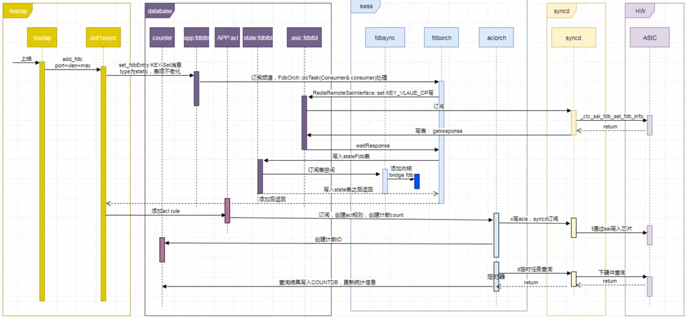

一、dot1x/mac认证

1.802.1x协议介绍

802.1x协议是一种基于端口的网络接入控制协议，即在局域网接入设备的端口上对所接入的用户和设备进行认证，以便控制用户设备对网络资源的访问。

802.1x系统中包含三个实体：客户端（client）、设备端（device）和认证服务器（authentication server），如下图所示：

802.1x认证流程（中继方式）

802.1x认证触发方式
    客户端主动触发：组播触发/广播触发
    设备端主动触发：组播触发/单播触发

hostapd现状
    命令行启动，指定监听端口、后台运行、日志目录、全局socket路径、配置文件
    dot1x认证支持情况：
        不支持通过配置控制业务启停
        不支持arp报文触发认证
        不支持客户端带vlan报文的认证报文解析
        不支持数据恢复，进程重启数据丢失
        hostapd虽然支持802.1x认证，但也只是停留在协议层，下内核等操作并不支持，也就是完整的认证并可转发报文的功能并不支持

dot1x拉起
    systemctl start/stop/enable/disable dot1x.service
    使能过程中，确保hostapd在dot1xsyncd启动之后启动，通过容器的supervisor.conf控制

接口使能
    

接口去使能

用户上线
    hostapd将fdb信息推给dot1xsyncd，dot1xsyncd下发fdb(APPLDB)，同时创建acl rule(APPLDB)用于统计流量
    

用户下线
    hostapd下线用户，将fdb信息推给dot1xsyncd，dot1xsyncd删除fdb，同时删除acl rule

统计信息获取
    hostapd通过dot1xsyncd获取用户流量信息，dot1x负责从COUNTDB读取统计信息数据返回给hostapd

在线用户查询：
    cli从APPDB和COUNTERDB中读取数据

支持带vlan用户上线
    修改创建socket时监听所有二层协议
    修改recvmsg函数
    接口pvid变化

hostapd和dot1xsyncd交互
    用户fdb表项下发，数据恢复
    计费查询，轮询获取流量信息

通过netlink响应接口事件
    hostapd初始化时要监听netlink_route事件，当接口down时，会上报netlink事件

ACL修改
    增加acl表类型
    acl配置

二、ISIS项目

SPF算法
    核心逻辑：贪心策略
    核心思想：每次都选择当前已知的、离起点最近的节点，并以此位跳板去更新其他节点的距离

2. 数学表达在算法运行过程中，对于每一条边 $(u, v)$，如果通过节点 $u$ 到达 $v$ 的路径比当前记录的 $v$ 的路径更短，我们就进行更新。其判别式为：$$dist(v) > dist(u) + weight(u, v)$$如果上述条件成立，则更新：$$dist(v) = dist(u) + weight(u, v)$$

三、异构分级项目

背景：随着存储技术发展，各类存储介质在性能与成本上的差异日益显著，使得用户在平衡性能需求和存储成本上面临挑战。同时，用户常拥有多品牌、多型号的异构存储设备，并希望将其整合利用。因此，用户需要一种能够对数据进行自动分级存储与智能管理的方案，根据数据使用频率将其动态分配至不同性能的设备中，从而实现存储资源的优化利用与数据的合理流动。

四、大集群项目

支持海量数据（PB甚至EB级），具有一下几个特点：
1. 去中心化（分布式架构）
集群里没有绝对的“老大”。数据被切成碎片，均匀地分布在不同服务器的磁盘上。
好处：当你读取文件时，几十台服务器同时为你提供 IO，速度极快。

2. 高可用与容错（数据冗余）
在大集群里，“硬盘坏掉”或“某台服务器宕机”被视为常态。
多副本：同一份数据存三份，坏掉两台机器，数据依然在线。
纠删码 (Erasure Coding)：类似 RAID 的高级版本，用更少的空间换取极高的安全性。

3. 横向扩展（Scale-Out）
这是“大集群”最牛的地方。
如果空间不够了，你不需要换更贵的服务器，只需要像加乐高积木一样，往机柜里再推入几台新服务器。集群会自动识别并把容量“吐”出来，业务完全不用停机。

4. 统一命名空间 (Global Namespace)
不管底层有多少台服务器，用户看到的只是一个挂载点（比如 Z:\ 盘或一个 URL）。你不需要知道文件具体在哪台物理机上，集群背后的元数据服务会帮你找到它。