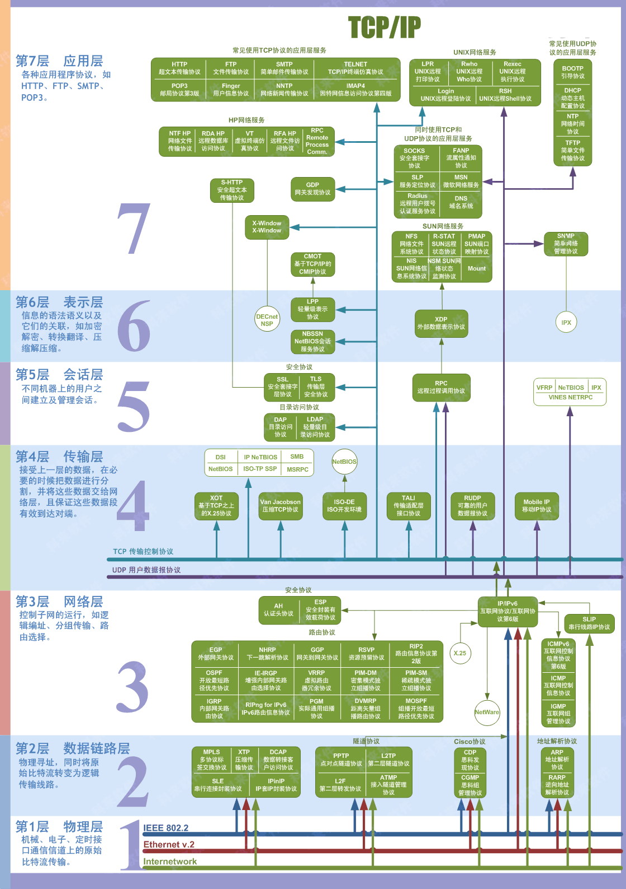

准备网络工程师（Network Engineer）的面试，本质上是考察你对**底层协议的理解、项目实战经验以及排障（Troubleshooting）的逻辑思维**。

为了帮你高效复习，我将面试高频考点分成了四个维度。你可以根据自己的应聘岗位（校招/社招）有所侧重。

---

## 一、 基础理论：必须烂熟于心

这部分是面试的“入场券”，答错基本就直接凉凉。

### 1. OSI 七层模型与 TCP/IP 四层模型

* **高频题：** 请简述每层的功能及常见协议
* OSI 模型（从上到下）：
  * 应用层
    * 功能：为应用程序提供网络服务（文件传输、邮件、网页）
    * 协议：HTTP、FTP、SMTP、DNS
  * 表示层
    * 功能：数据格式转换、加密解密、压缩解压
    * 协议：SSL/TLS、JPEG、ASCII
  * 会话层
    * 功能：建立、管理和终止会话连接，控制通信节奏
    * 协议：RPC、SQL、NFS
  * 传输层
    * 功能：提供端到端的可靠或不可靠的数据传输服务
    * 协议：TCP（可靠，面向连接）、UDP（不可靠，无连接）
  * 网络层
    * 功能：负责数据包的路由选择和转发
    * 协议：IP（IPv4/IPv6）、ICMP、IGMP、ARP、RIP、OSPF、BGP
  * 数据链路层
    * 功能：将比特流封装成帧，进行差错控制和流量控制
    * 协议：Ethernet、PPP、HDLC、MAC
  * 物理层
    * 功能：传输原始比特流，定义电气、机械、功能和过程规范
    * 协议：RJ45、光纤、无线电频率
  * 
  * TCP/IP 模型（从上到下）：
    * 应用层（Application Layer）：对应于 OSI 参考模型的（应用层、表示层、会话层）
    * 传输层（Transport Layer）：对应于 OSI 参考模型的传输层
    * 网际层（Internet Layer）：对应于 OSI 参考模型的网络层
    * 网络接口层（Network Interface Layer）：对应于 OSI 参考模型的数据链路层和物理层
* **对比：** 为什么现在普遍使用 TCP/IP 而不是 OSI？
    *OSI理论完美但复杂、实现难、出现晚；TCP/IP简单实用、早成熟、互联网全靠它，所以成为实施标准 

### 2. TCP/UDP 的爱恨情仇

* **三次握手与四次挥手：** 状态位（SYN, ACK, FIN, RST）的变化，以及为什么是三次而不是两次？为什么挥手要四次？
* **可靠性保证：** 序列号、确认应答、超时重传、滑动窗口、拥塞控制。

### 3. IP 地址与子网划分

* **计算题：** 给定一个 IP 和掩码，算出网络地址、广播地址及可用主机数。
* **IPv6：** 与 IPv4 的区别，常见的过渡技术（双栈、隧道）。

---

## 二、 核心协议：路由与交换

这是网工的“看家本领”。

### 1. 二层交换（Switching）

* **VLAN：** 为什么要划分 VLAN？Trunk 链路（802.1Q）的作用。
* **STP（生成树协议）：** 解决环路问题的原理，选举根桥的规则。
* **ARP：** 已知 IP 求 MAC 的过程，ARP 欺骗是什么？

### 2. 三层路由（Routing）

* **OSPF：** 核心考点。LSA 的类型、邻居状态机（Down -> Full）、DR/BDR 的选举。
* **BGP：** 选路规则（13 条属性）、IBGP 与 EBGP 的区别。为什么大网要用 BGP？
* **路由优先级：** 直连 > 静态 > 动态（OSPF/BGP 等）。

---

## 三、 网络服务与安全

现在的企业面试非常看重安全和自动化。

* **DHCP：** 四个数据包过程（Discover, Offer, Request, Ack）。
* **DNS：** 递归查询与迭代查询的区别。
* **NAT：** 静态 NAT、动态 NAT、NAPT（端口映射）的原理。
* **VPN：** IPsec VPN（IKE 两个阶段）、SSL VPN。
* **防火墙：** 状态检测防火墙与包过滤防火墙的区别。

---

## 四、 实战与排障（最有含金量）

面试官最喜欢问：“如果一个用户反馈上不了网，你该如何排障？”

> **标准排障思路（自底向上）：**
> 1. **物理层：** 网线插好了吗？灯亮吗？
> 2. **数据链路层：** MAC 地址学到了吗？VLAN 配置对吗？接口有没有丢包？
> 3. **网络层：** 互通性测试（Ping/Traceroute）。网关能不能通？ARP 表项是否正常？
> 4. **应用层：** DNS 能解析吗？防火墙策略是否拦截了端口？
> 
> 

---

## 💡 面试加分项（中高级必看）

如果你能聊出以下内容，面试官会觉得你很有深度：

* **SDN (软件定义网络)：** 控制平面与数据平面分离，OpenFlow，VXLAN 原理。
* **无线 (WLAN)：** CAPWAP 隧道、漫游过程。
* **NetDevOps：** Python 网络自动化（Paramiko, Netmiko）、Ansible 自动化配置。
* **负载均衡：** F5、LVS、Nginx 的四层/七层负载区别。

---

## 🛠 面试避坑小贴士

1. **别死记硬背：** 尽量用“数据包的视角”去描述过程，比如“这个包从交换机 A 出来，打上 VLAN Tag...”。
2. **承认盲点：** 遇到没听过的私有技术，可以诚实说“这个特定厂商的技术我不熟悉，但我对标准的 RFC 协议很有研究”。
3. **准备项目故事：** 准备一个“你解决过的最难的网络故障”，按照 **背景 -> 现象 -> 排查过程 -> 最终根因 -> 复盘预防** 的逻辑来写。

**你想针对某个具体的协议（比如 OSPF 的状态切换）进行模拟面试，还是需要我为你整理一份常见的网络工具命令手册？**